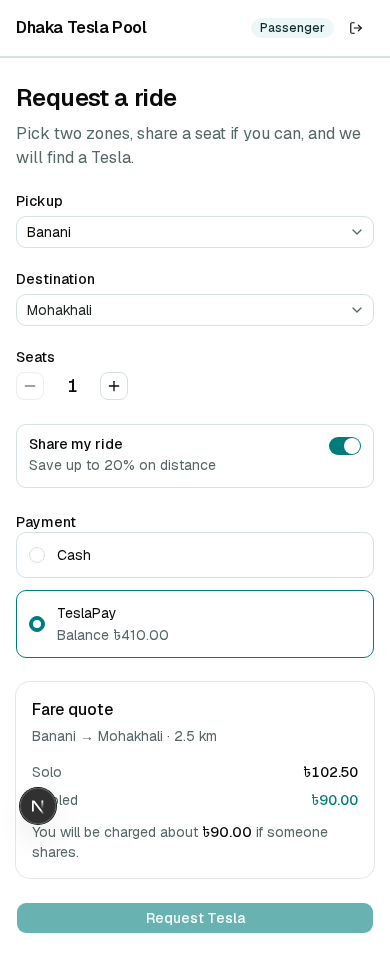
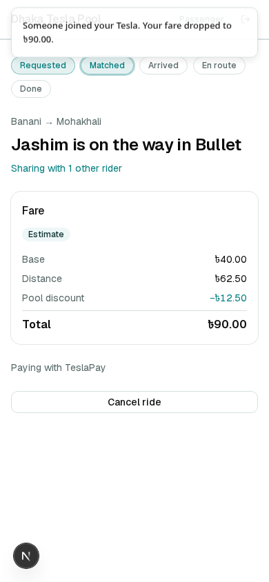
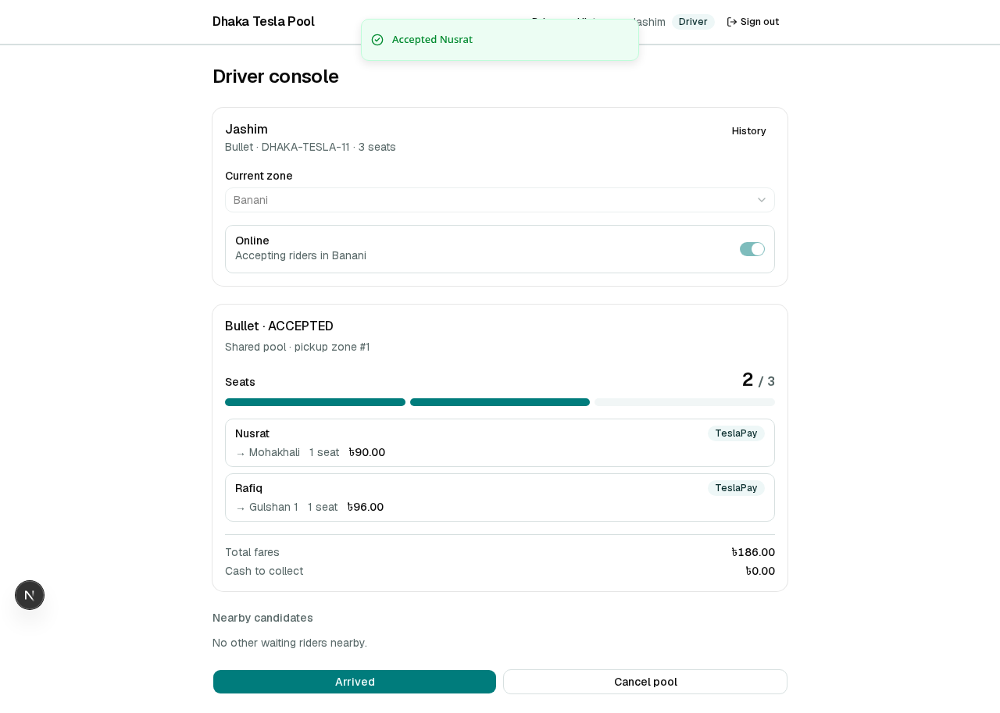
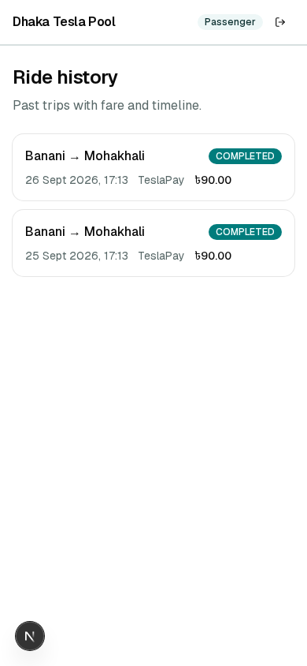
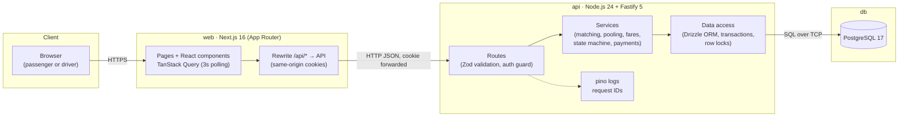
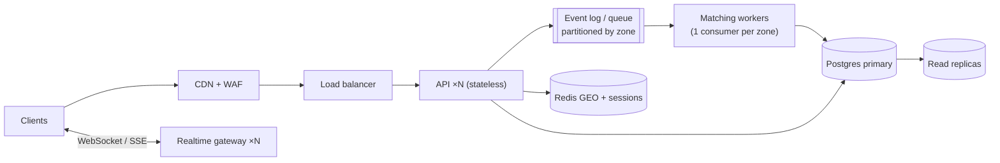

# Dhaka Tesla Pool

> Share a seat. Split the fare. Survive Dhaka traffic.

Simulated shared-ride MVP for three-wheeled electric "Teslas" in Dhaka — passengers pool compatible trips, drivers run a clear lifecycle, and seat capacity stays correct under concurrent claims.

**Demo video:** _to be added on `release/v1.0.0` (Phase 15)_  
**Deployment:** local Docker Compose (see [docs/DEPLOY.md](./docs/DEPLOY.md)) — free-tier Neon / Render / Vercel were not provisioned for this submission; Compose is the documented run target.

Companion docs: [`docs/PRD.md`](./docs/PRD.md) · [`docs/DESIGN.md`](./docs/DESIGN.md) · [`docs/TECH_STACK.md`](./docs/TECH_STACK.md) · [`docs/TASKS.md`](./docs/TASKS.md)

---

## Summary and problem

Dhaka's rush-hour traffic makes solo CNG / "Tesla" trips expensive and wasteful when several people leave the same neighbourhood for nearby destinations. Dhaka Tesla Pool lets a passenger request a ride between known areas; if another rider is heading a compatible direction from the same pickup and the vehicle has seats, they share the car and each pay their own discounted fare. The driver sees who is aboard and advances one pool through arrived → started → completed. Money, capacity, and status live in Postgres so two last-seat clicks cannot overbook Bullet.

---

## Features implemented

| PRD ID | Feature | Status |
|---|---|---|
| AUTH-1…6 | Passenger sign-up / sign-in / sign-out; seeded drivers; role guards | Done |
| PAS-1…9 | Request form, fare quote, status tracking, cancel rules, history | Done |
| PAS-10 | TeslaPay wallet balance + transactions | Done |
| DRV-1…10 | Online/offline, waiting feed, accept, seat meter, lifecycle, history | Done |
| POOL-1…8 | Matching, capacity, exclusive pools, fare recalc, freeze at start | Done |
| PAY-1…5 | Cash / wallet, solo-estimate check, single charge on complete | Done |
| HIST-1…3 | Append-only ride events on passenger and driver history | Done |

P2 items (ride ratings, multi-stop pickup, WebSockets) are out of scope for v1.

---

## Screenshots

| Request form | Active pooled ride |
|---|---|
|  |  |

| Driver pool + seat meter | Ride history |
|---|---|
|  |  |

---

## Architecture



The browser only talks to the Next.js origin. Next.js rewrites `/api/*` to Fastify so the `dtp_session` cookie stays first-party.

### ERD

```mermaid
erDiagram
    users ||--o| driver_profiles : "has (drivers only)"
    users ||--o| vehicles : "drives (drivers only)"
    users ||--o| wallets : owns
    users ||--o{ ride_requests : "requests (passengers)"
    zones ||--o{ zone_distances : from
    zones ||--o{ zone_distances : to
    zones ||--o{ ride_requests : "pickup / dropoff"
    zones ||--o{ pools : pickup
    zones ||--o{ driver_profiles : "current zone"
    vehicles ||--o{ pools : runs
    pools ||--o{ pool_members : contains
    ride_requests ||--o{ pool_members : "joins (≤1 active)"
    ride_requests ||--o{ ride_events : logs
    pools ||--o{ ride_events : logs
    wallets ||--o{ wallet_transactions : records
    ride_requests ||--o| wallet_transactions : "charged by"

    users {
        uuid id PK
        user_role role
        text name
        text email UK
        text phone UK
        text password_hash
    }
    vehicles {
        uuid id PK
        uuid driver_id FK,UK
        text name
        text plate UK
        smallint capacity
    }
    ride_requests {
        uuid id PK
        uuid passenger_id FK
        smallint seats
        request_status status
        integer solo_fare_paisa
        integer final_fare_paisa
    }
    pools {
        uuid id PK
        uuid vehicle_id FK
        smallint capacity
        smallint seats_taken
        pool_status status
    }
    pool_members {
        uuid id PK
        uuid pool_id FK
        uuid ride_request_id FK
        smallint seats
        integer fare_paisa
        member_status status
    }
    wallets {
        uuid user_id PK,FK
        bigint balance_paisa
    }
```

Full column detail: [`docs/DESIGN.md` §7](./docs/DESIGN.md#7-database-schema).

---

## Tech stack

| Layer | Choice | Why (short) |
|---|---|---|
| Frontend | Next.js 16 + React 19 + TypeScript | Mandated; App Router + `/api/*` rewrite for first-party cookies |
| UI | Tailwind CSS 4 + shadcn/ui | Accessible primitives in-repo; mobile-first |
| Client state | TanStack Query 5 | 3 s polling, retries, mutation invalidation |
| Backend | Node.js 24 + Fastify 5 | Mandated runtime; schema-first routes + `inject()` tests |
| Contracts | Zod 4 in `packages/shared` | One shape for forms and API validation |
| Database | PostgreSQL 17 | Row locks, CHECK, partial unique indexes |
| ORM | Drizzle + committed SQL migrations | `.for('update')` visible; no Prisma escape hatches on the hot path |
| Auth | Argon2id + JWT in httpOnly cookie `dtp_session` | Seedable demo accounts; no third-party auth |
| Tests | Vitest + real Postgres; Playwright e2e | Integrity under concurrency; one rush-hour UI story |
| Repo | npm workspaces | `apps/web`, `apps/api`, `packages/shared` |
| Containers | Docker Compose | Mandated portable demo |

Full justifications and switch criteria: [`docs/TECH_STACK.md`](./docs/TECH_STACK.md).

---

## Project structure

```
.
├── apps/
│   ├── api/                 # Fastify service, Drizzle schema, Vitest
│   └── web/                 # Next.js App Router UI + Playwright e2e
├── packages/
│   └── shared/              # Zod schemas / DTOs only
├── docs/                    # PRD, DESIGN, TECH_STACK, TASKS, DEPLOY
├── compose.yaml
├── .env.example
└── README.md
```

---

## Prerequisites

- **Docker** (or Podman with Compose) — recommended path
- **or** Node.js **24+** and npm 10+ for host-side `npm run dev`
- About 2 GB free disk for images and `node_modules`

---

## Environment variables

Copy [`.env.example`](./.env.example) to `.env`. Never commit real secrets.

| Variable | Purpose |
|---|---|
| `DATABASE_URL` | Postgres for API / migrate / seed (host port `54329` outside Compose) |
| `TEST_DATABASE_URL` | Isolated DB for Vitest (`54330`, Compose profile `test`) |
| `JWT_SECRET` | ≥32 characters; signs `dtp_session` |
| `API_INTERNAL_URL` | Next.js rewrite target (`http://localhost:48080` on host; `http://api:4000` baked into the web image) |
| `WEB_ORIGIN` | Allowed browser origin for cookies / CORS edge cases |
| `FARE_*` / `POOL_DETOUR_LIMIT_M` | Fare and matching knobs (defaults match the PRD) |
| `POSTGRES_IMAGE` | Optional override when `postgres:17-alpine` cannot be pulled (e.g. `pgvector/pgvector:pg16`) |

---

## Local setup

### Docker Compose (preferred)

```bash
cp .env.example .env
# set JWT_SECRET to a long random string
docker compose up --build
```

| Service | Host port |
|---|---|
| Web | http://localhost:43123 |
| API | http://localhost:48080 (`GET /health`) |
| Postgres | `localhost:54329` |

The `migrate` one-shot runs migrations and the idempotent seed before `api` starts.

Reset the demo cast (truncates rides/pools/events/transactions, re-seeds):

```bash
docker compose exec api node dist/db/seed.js --reset
# or from the host with DATABASE_URL pointed at 54329:
npm run db:seed:reset
```

### Host-side Node (API + web)

```bash
cp .env.example .env
docker compose up -d db          # Postgres only
npm ci
npm run db:migrate
npm run db:seed
npm run dev -w @teslapool/api    # :48080 via compose mapping / API_PORT
npm run dev -w @teslapool/web    # :43123
```

---

## Running tests

```bash
# unit + integration (needs db-test)
docker compose --profile test up -d db-test
npm test

# Playwright rush-hour story (API + web already running; seed reset first)
npm run db:seed:reset
npm run test:e2e -w @teslapool/web
```

Lint / types: `npm run lint && npm run typecheck`.

---

## Demo credentials

Password for every seeded account: **`TeslaPool!2026`**

The home page also has one-click **Continue as …** buttons for the cast.

| Name | Email | Role | Notes |
|---|---|---|---|
| Jashim | `jashim@teslapool.test` | DRIVER | Vehicle **Bullet**, plate `DHAKA-TESLA-11`, capacity 3 |
| Nusrat | `nusrat@teslapool.test` | PASSENGER | Wallet ৳500.00 |
| Rafiq | `rafiq@teslapool.test` | PASSENGER | Wallet ৳300.00 |
| Shirin | `shirin@teslapool.test` | PASSENGER | Wallet ৳50.00 (below her ৳80 solo fare → `INSUFFICIENT_BALANCE`; cash still works) |

Seed also includes one **completed** Banani rush-hour pool (Nusrat + Rafiq, ৳90 / ৳96) so history is never empty.

### Manual demo (PRD §2)

1. Sign in as Jashim → Current zone **Banani** → go **Online**.
2. As Nusrat: Banani → Mohakhali → Request Tesla.
3. Jashim **Accept**.
4. As Rafiq: Banani → Gulshan 1 → auto-matches; fares show **৳90.00** / **৳96.00**.
5. Jashim: Arrived → Start trip → Complete trip.
6. Check History on both passengers.

`npm run db:seed:reset` between runs.

---

## API overview

Base path: `/api/v1`. Session cookie: `dtp_session`.

| Method | Path | Who | Purpose |
|---|---|---|---|
| POST | `/auth/signup` | public | Passenger sign-up (+ ৳200 wallet) |
| POST | `/auth/login` | public | Sign in |
| POST | `/auth/logout` | auth | Clear cookie |
| GET | `/auth/me` | auth | Current user |
| GET | `/zones` | auth | Dhaka areas |
| GET | `/fares/quote` | auth | Solo + pooled estimate |
| POST | `/rides` | passenger | Create request (optional `Idempotency-Key`) |
| GET | `/rides` | passenger | History |
| GET | `/rides/:id` | passenger | Own ride detail |
| POST | `/rides/:id/cancel` | passenger | Cancel when allowed |
| PATCH | `/driver/status` | driver | Online / offline + zone |
| GET | `/driver/requests` | driver | Waiting requests in zone |
| GET | `/driver/pools/current` | driver | Active pool |
| GET | `/driver/pools` | driver | Pool history |
| POST | `/pools/requests/:id/accept` | driver | Create pool from request |
| GET | `/pools/:id/candidates` | driver | Compatible waiting riders |
| POST | `/pools/:id/members` | driver / system | Claim seats into pool |
| POST | `/pools/:id/arrive\|start\|complete\|cancel` | driver | Lifecycle |
| GET | `/wallet` | passenger | Balance + transactions |
| GET | `/health` | public | Liveness + DB ping |

Errors use stable codes (`POOL_FULL`, `INVALID_TRANSITION`, `INSUFFICIENT_BALANCE`, …) with HTTP 4xx/409.

---

## Fare model

```
passengerFare = baseFare + distanceCharge − poolDiscount

baseFare       = ৳40.00          (4,000 paisa)
distanceCharge = ৳25.00 / km     (2,500 paisa/km of the passenger's own trip)
poolDiscount   = 20% of distanceCharge when the pool has ≥ 2 active members, else 0
```

Money is **integer paisa** only. Distances are multiples of 100 m so 20% is always whole paisa. Estimates recompute on join/leave and **freeze at `STARTED`**.

### Worked example

| | Nusrat | Rafiq |
|---|---|---|
| Trip | Banani → Mohakhali (2.5 km) | Banani → Gulshan 1 (2.8 km) |
| Solo | ৳102.50 | ৳110.00 |
| Pooled | **৳90.00** | **৳96.00** |

---

## Matching rule and ride lifecycle

A waiting request **R** joins pool **P** when all hold:

1. `P.status` ∈ {`ACCEPTED`, `DRIVER_ARRIVED`}
2. Both allow pooling (`P.is_shared`, `R.allow_pool`)
3. Same pickup zone
4. Every active member's dropoff is within **3.0 km** of R's dropoff
5. Seats fit: `seats_taken + R.seats ≤ capacity`

FIFO among compatible pools. Otherwise R stays `REQUESTED`.

**State machines**

- Request: `REQUESTED → MATCHED → DRIVER_ARRIVED → STARTED → COMPLETED` (or `CANCELLED`)
- Pool: `ACCEPTED → DRIVER_ARRIVED → STARTED → COMPLETED` (or `CANCELLED`)

Driver actions move the **pool**; every active member's request status mirrors the pool in the same transaction. Passenger cancel before start releases seats and recalculates co-riders; driver cancel before start re-queues passengers as `REQUESTED`.

---

## Concurrency (last seat)

Every membership change goes through `claimSeats`, which takes a **row lock** on the pool (`SELECT … FOR UPDATE`) before re-checking capacity and inserting `pool_members`.

`apps/api/test/concurrency.test.ts` proves this under load:

1. **Last seat (50×).** Bullet has 1 seat left. Nusrat and Shirin call `claimSeats` on **two separate `pg` pools** with `Promise.allSettled`. Exactly one fulfills; the other gets `409 POOL_FULL`; `seats_taken = 3`.
2. **Double accept.** Jashim and a test-only driver **Karim** (vehicle **Rocket**) accept Nusrat at once; she ends in exactly one pool.
3. **HTTP last seat (50×).** Same race via `POST /api/v1/pools/:id/members`.
4. **Double submit.** Two parallel `POST /rides` without an idempotency key → one `201`, one `409 ACTIVE_RIDE_EXISTS`.

### Experiment (interview material)

Temporarily remove `FOR UPDATE` from `claimSeats` and re-run test 1: both transactions can read `seats_taken = 2`, both insert, and you either overbook until the `CHECK (seats_taken BETWEEN 0 AND capacity)` fires (mapped to `POOL_FULL`) or see `seats_taken > capacity` if that check is also removed. Put the lock back — the race test goes green again. The lock is the intentional serialisation point; the CHECK is defence in depth.

### At scale

Per-pool row locks stay fine while contention is per vehicle. For city-wide rush hour, matching moves to **zone-partitioned workers** so seat claims serialise per partition without one global hotspot — see [Bonus](#bonus-if-oi-tesla-goes-viral) and [`DESIGN.md` §14](./docs/DESIGN.md#14-bonus-if-oi-tesla-goes-viral).

---

## Key decisions and trade-offs

| Decision | Trade-off |
|---|---|
| Fastify service separate from Next.js | Extra process; clear API boundary for the brief |
| `FOR UPDATE` on pool rows | Serialises joins on a hot pool; correct over optimistic retries alone |
| Integer paisa + 100 m distances | No float rounding; less flexible tariffs |
| Polling every 3 s | Simple on free tiers; wasteful at viral scale |
| JWT in httpOnly cookie | No server-side revocation before expiry |
| Fixed 10 zones + distance table | Hand-checkable; not real GPS routing |
| Drivers seeded only | No self-serve driver onboarding |

Assumptions A1–A13: [`docs/PRD.md` §12](./docs/PRD.md#12-assumptions).

---

## Known limitations and next improvements

- No automatic request expiry or scheduled rides
- No multi-stop pickup ordering or seat-scaled fares
- No cancellation fee after driver arrival
- Polling instead of WebSocket / SSE push
- Single Postgres instance; no read replicas
- Free-tier cloud deploy not wired; Compose is the documented deployment ([docs/DEPLOY.md](./docs/DEPLOY.md))

---

## AI usage

Built with **Cursor** (Agent / Composer) against the planning docs in `docs/`.

| Used for | Examples |
|---|---|
| Scaffolding | npm workspaces, Compose, Drizzle schema, Fastify modules, Next.js screens |
| Tests | Vitest concurrency suite, Playwright rush-hour story |
| Docs | README / DEPLOY assembled from PRD, DESIGN, TECH_STACK |

**Accepted suggestion.** Putting seat claims behind a single `claimSeats` transaction with `SELECT … FOR UPDATE`, then proving it with dual-`pg`-pool races — kept capacity correct and gave a clear interview story.

**Rejected / changed suggestion.** Early drafts pushed WebSockets for live status and a heavier admin/driver onboarding UI. Rejected for v1: the brief rewards integrity and an explainable demo over realtime infra; TanStack Query polling at 3 s is enough for a handful of status transitions, and driver accounts stay seed-only (PRD A7).

AI did not invent the fare numbers or cast — those come from the PRD worked example and are locked by unit + e2e tests.

---

## Bonus: if Oi Tesla goes viral

Target reasoning only (not built): 1M passengers, 100k drivers.



| Concern | Approach |
|---|---|
| Matching | Zone-partitioned workers; serialise seat claims per partition |
| Realtime | WebSocket/SSE fed by domain events; polling as fallback |
| Geo | H3 / PostGIS + Redis GEO for live drivers |
| Data | Short transactions, keep constraints, later shard by city |
| Ops | Outbox events, idempotent consumers, edge rate limits, canaries |

MVP already keeps the API **stateless**, rules in one service layer, DB constraints as the last line of defence, and an append-only event log — so this path is configuration and new workers, not a rewrite. Detail: [`docs/DESIGN.md` §14](./docs/DESIGN.md#14-bonus-if-oi-tesla-goes-viral).
