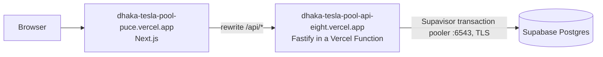

# Deployment guide

## Live deployment

| Surface | URL |
|---|---|
| Application | https://dhaka-tesla-pool-puce.vercel.app |
| API health | https://dhaka-tesla-pool-api-eight.vercel.app/health |
| Repository | https://github.com/DJRCX/dhaka-tesla-pool |

Demo accounts and the rush-hour walkthrough are in the [README](../README.md#demo-credentials). Everything runs on free tiers in Mumbai, the closest region to Dhaka:

| Piece | Host | Region |
|---|---|---|
| Web (Next.js) | Vercel Hobby, project `dhaka-tesla-pool`, root `apps/web` | `bom1` |
| API (Fastify) | Vercel Function, project `dhaka-tesla-pool-api`, root `apps/api` | `bom1` |
| Database | Supabase free Postgres 17 | `ap-south-1` |



The browser only ever calls the web origin, so the `dtp_session` cookie stays first-party, exactly as in Docker Compose.

---

## How the Vercel setup works

### API project (`apps/api`)

- [`apps/api/api/index.js`](../apps/api/api/index.js) is the single Vercel Function. It builds the Fastify app once per instance from the compiled `dist/` output and hands each request to `app.server`.
- [`apps/api/vercel.json`](../apps/api/vercel.json) installs and builds from the monorepo root (`npm ci`, then build `@teslapool/shared` and `@teslapool/api`), pins the function to `bom1`, and rewrites every path to that function. `framework` is `null` on purpose: Vercel's Fastify auto-detection would pick `src/app.ts`, which only exports `buildApp()`.
- `apps/api/public/robots.txt` exists because Vercel needs a non-empty output directory. It also keeps crawlers off the API.

| Variable | Value |
|---|---|
| `DATABASE_URL` | `postgres://teslapool_app.<project-ref>:<password>@aws-0-ap-south-1.pooler.supabase.com:6543/postgres?sslmode=no-verify` (sensitive) |
| `JWT_SECRET` | 64 random hex characters (sensitive) |
| `TRUST_PROXY` | `true` |
| `WEB_ORIGIN` | `https://dhaka-tesla-pool-puce.vercel.app` |
| `LOG_LEVEL` | `info` |

### Web project (`apps/web`)

- [`apps/web/vercel.json`](../apps/web/vercel.json) builds `@teslapool/shared` first, then the Next.js app.
- `API_INTERNAL_URL=https://dhaka-tesla-pool-api-eight.vercel.app`. Next.js bakes rewrites in at **build** time, so change it and redeploy together.

### Database (Supabase)

1. Create a free project in `ap-south-1`.
2. In the SQL editor, create a dedicated login role that will own the schema:

```sql
CREATE ROLE teslapool_app LOGIN PASSWORD '<long random password>';
GRANT CREATE, CONNECT ON DATABASE postgres TO teslapool_app;
GRANT USAGE, CREATE ON SCHEMA public TO teslapool_app;
```

3. From a machine with Node 24+, migrate and seed as that role through the **session** pooler (port 5432):

```bash
export DATABASE_URL='postgres://teslapool_app.<project-ref>:<password>@aws-0-ap-south-1.pooler.supabase.com:5432/postgres?sslmode=no-verify'
export JWT_SECRET='<same secret as the API>'
npm ci
npm run db:migrate
npm run db:seed
```

4. Supabase exposes the `public` schema through its auto-generated Data API. Enable row-level security on every table with **no policies**, so the Data API sees nothing. The API is unaffected because `teslapool_app` owns the tables, and owners bypass RLS:

```sql
-- run as teslapool_app
DO $$ DECLARE t text; BEGIN
  FOR t IN SELECT tablename FROM pg_tables WHERE schemaname = 'public' AND tableowner = current_user LOOP
    EXECUTE format('ALTER TABLE public.%I ENABLE ROW LEVEL SECURITY', t);
  END LOOP;
END $$;
```

5. The deployed API uses the **transaction** pooler (port 6543), which suits many short-lived serverless connections. Row locks (`SELECT … FOR UPDATE`) still work because each seat claim runs inside a single transaction.

### Reset the live demo data

Run the same command as locally, with the session-pooler `DATABASE_URL` from step 3:

```bash
npm run db:seed:reset
```

### Verify

```bash
curl https://dhaka-tesla-pool-api-eight.vercel.app/health      # {"status":"ok","db":"ok"}
E2E_BASE_URL=https://dhaka-tesla-pool-puce.vercel.app npm run test:e2e -w @teslapool/web
npm run db:seed:reset                                           # e2e leaves a completed ride behind
```

---

## Free-tier limits

| Provider | Limit that affects the demo |
|---|---|
| Vercel Hobby | The first request after idle pays a function cold start plus a new database connection (about 1–2 s). Non-commercial use only |
| Supabase free | Projects pause after about a week with no traffic; resume from the dashboard. 500 MB database, shared compute |

Checked on 27 September 2026.

---

## Fallback: Docker Compose

Works on any machine with Docker (or Podman with Compose).

```bash
git clone https://github.com/DJRCX/dhaka-tesla-pool.git
cd dhaka-tesla-pool
cp .env.example .env
# Set JWT_SECRET to ≥32 random characters before exposing the host
docker compose up --build
```

| URL | Service |
|---|---|
| http://localhost:43123 | Web (Next.js standalone) |
| http://localhost:48080/health | API health |
| localhost:54329 | Postgres |

- `migrate` runs SQL migrations and the seed, then exits.
- The web image bakes `API_INTERNAL_URL=http://api:4000` in at build time. Rebuild `web` if that URL changes.
- If `postgres:17-alpine` cannot be pulled, set `POSTGRES_IMAGE=docker.io/pgvector/pgvector:pg16` (or another Postgres 16+ image) in `.env`.
- Reset demo data: `docker compose exec api node dist/db/seed.js --reset`.

### CI

GitHub Actions (`.github/workflows/ci.yml`) runs lint, typecheck, Vitest against the Compose `db-test` service, and builds both images.
