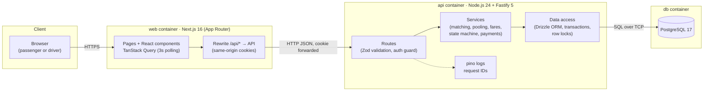
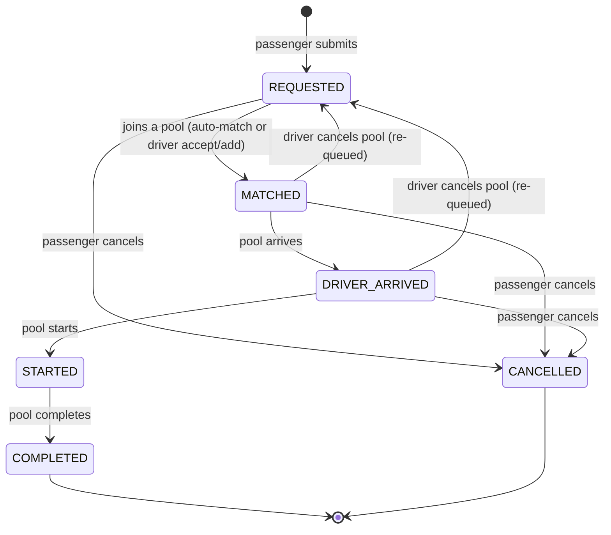
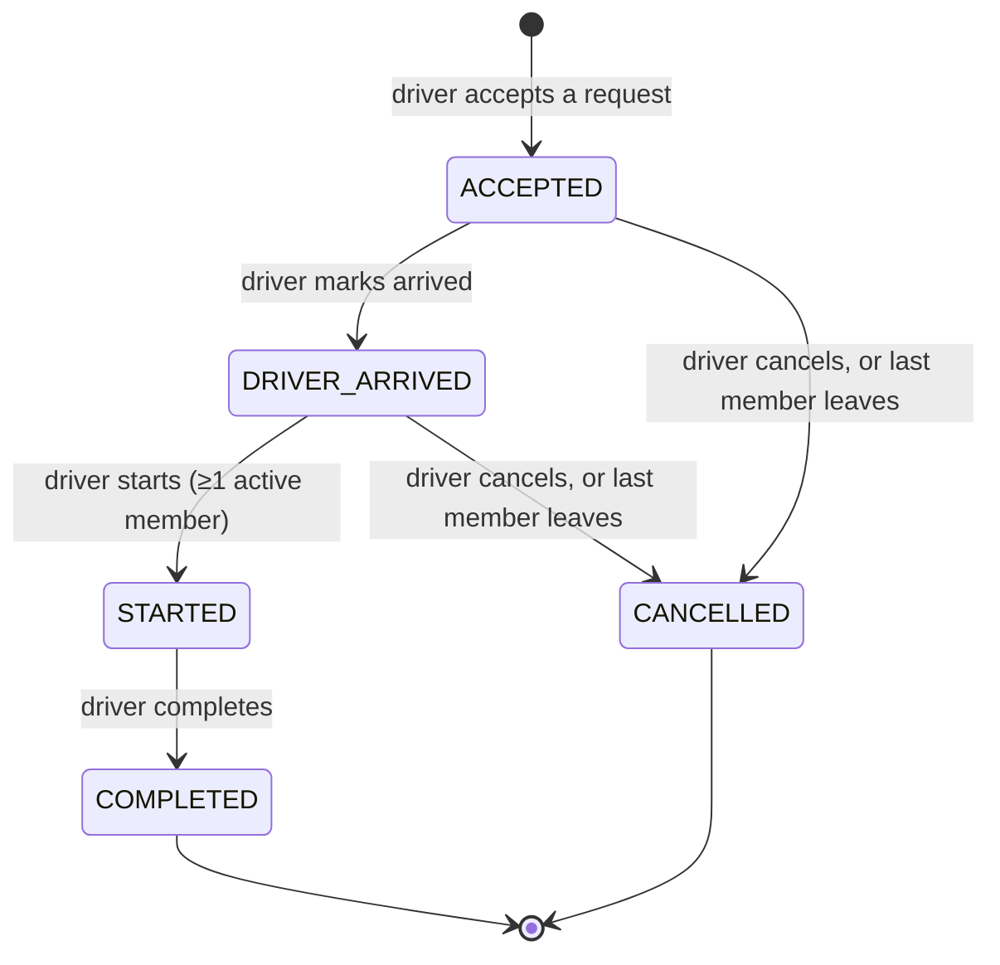
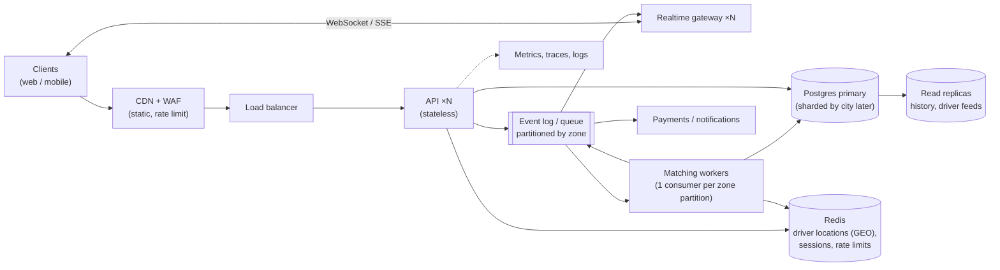

# Dhaka Tesla Pool — System Design

| | |
|---|---|
| Scope | v1.0.0 MVP |
| Companion docs | [`PRD.md`](./PRD.md) · [`TECH_STACK.md`](./TECH_STACK.md) · [`TASKS.md`](./TASKS.md) |

This document is the source of truth for how the system is built. If the implementation diverges, update this file in the same pull request. The brief asks that the implementation "broadly match the documented architecture."

---

## 1. Design principles

1. **The database is the last line of defence.** Every business invariant that can be a constraint is one: capacity, one active ride per passenger, one active pool per vehicle, non-negative wallet balance, no double charge.
2. **One transaction per business action.** Join, leave, start, complete, and pay each commit all-or-nothing.
3. **Business logic lives in the API's service layer.** Route handlers validate and delegate. The frontend displays state; it never decides it.
4. **Boring and explainable beats clever.** One API process, one Postgres, one Next.js app. No infrastructure without a reason.
5. **The story is the test suite.** Jashim, Bullet, Nusrat, Rafiq, and Shirin appear in seed data, tests, and the demo.

## 2. Architecture



**Request path.** The browser only talks to the Next.js origin. Next.js rewrites `/api/*` to the Fastify service. This keeps the session cookie first-party in both local Docker and a split deployment (web on Vercel, API elsewhere), and it avoids CORS.

**Why not Next.js Route Handlers for the backend?** The brief requires a Node.js backend and evaluates API design separately from the frontend. A standalone Fastify service keeps that boundary visible, testable without a browser, and matches the required diagram (Browser → Next.js → Node API → DB).

### Containers (`docker compose up`)

| Service | Image / build | Port (host) | Health check | Depends on |
|---|---|---|---|---|
| `db` | `postgres:17-alpine` | 54329 → 5432 | `pg_isready` | — |
| `migrate` | build `apps/api` (one-shot) | — | exits 0 | `db` healthy |
| `api` | build `apps/api` | 48080 → 4000 | `GET /health` | `migrate` completed |
| `web` | build `apps/web` | 43123 → 3000 | `GET /` | `api` healthy |

The `migrate` service runs migrations and then the idempotent seed. Uncommon host ports avoid clashing with other local projects.

## 3. Repository layout

```
.
├── apps/
│   ├── api/                      # Fastify service
│   │   ├── src/
│   │   │   ├── app.ts            # buildApp(): plugins, routes, error handler
│   │   │   ├── server.ts         # listen()
│   │   │   ├── config.ts         # env parsing (Zod)
│   │   │   ├── db/
│   │   │   │   ├── schema.ts     # Drizzle tables, enums, constraints
│   │   │   │   ├── client.ts
│   │   │   │   ├── migrate.ts
│   │   │   │   └── seed.ts       # cast + zones + distances
│   │   │   ├── modules/
│   │   │   │   ├── auth/         # routes, service, password, session
│   │   │   │   ├── zones/
│   │   │   │   ├── fares/        # pure fare functions
│   │   │   │   ├── rides/        # passenger ride requests
│   │   │   │   ├── pools/        # matching, seat claims, lifecycle
│   │   │   │   ├── driver/
│   │   │   │   └── wallet/
│   │   │   ├── lib/
│   │   │   │   ├── errors.ts     # AppError + codes
│   │   │   │   ├── state-machine.ts
│   │   │   │   └── events.ts     # recordEvent()
│   │   │   └── plugins/          # auth guard, rate limit, request id
│   │   ├── drizzle/              # generated SQL migrations (committed)
│   │   ├── test/
│   │   └── Dockerfile
│   └── web/                      # Next.js app
│       ├── src/app/              # routes (see §10)
│       ├── src/components/       # ui/ (shadcn) + feature components
│       ├── src/lib/              # api client, query hooks, money format
│       └── Dockerfile
├── packages/
│   └── shared/                   # Zod schemas, enums, DTO types shared by web + api
├── docs/                         # PRD, DESIGN, TECH_STACK, TASKS
├── compose.yaml
├── .env.example
└── README.md
```

`packages/shared` holds only contracts: enums, request/response Zod schemas, and types. Fare math and state rules stay in the API so there is exactly one authority.

## 4. Domain model

| Concept | Meaning |
|---|---|
| **User** | A person with one role: `PASSENGER` or `DRIVER` |
| **Driver profile** | Online/offline state and current zone for a driver |
| **Vehicle** | A driver's Tesla with a fixed seat capacity (Bullet, 3) |
| **Zone** | One of 10 predefined Dhaka areas |
| **Ride request** | One passenger's journey from pickup to dropoff, with its own status and fare |
| **Pool** | One trip of one vehicle; has capacity, seats taken, and its own status |
| **Pool member** | Links a request to a pool, with seats and the fare breakdown for that membership |
| **Ride event** | Append-only audit record of anything that happened |
| **Wallet** | Simulated TeslaPay balance and its transactions |

Why a separate **pool member** table instead of `ride_requests.pool_id`? A request can be in pool A, have the driver cancel, then join pool B. The membership table keeps both facts and stores the fare that applied to each membership. It is also where the "one active membership per request" constraint lives.

## 5. Geography

Ten seeded zones. Coordinates are approximate area centres and are used only for display. Matching and fares use the distance table.

| Slug | Name | Lat | Lng |
|---|---|---|---|
| `banani` | Banani | 23.7937 | 90.4029 |
| `gulshan-1` | Gulshan 1 | 23.7808 | 90.4161 |
| `gulshan-2` | Gulshan 2 | 23.7946 | 90.4143 |
| `mohakhali` | Mohakhali | 23.7776 | 90.4056 |
| `tejgaon` | Tejgaon | 23.7626 | 90.4007 |
| `farmgate` | Farmgate | 23.7577 | 90.3897 |
| `dhanmondi` | Dhanmondi | 23.7465 | 90.3760 |
| `mirpur-10` | Mirpur 10 | 23.8069 | 90.3687 |
| `uttara` | Uttara | 23.8759 | 90.3795 |
| `bashundhara` | Bashundhara | 23.8190 | 90.4380 |

**Distance table (km).** Generated once as haversine × 1.4 road factor, rounded to 100 m, then seeded as fixed data. The seed stores both directions, so lookup is a single primary-key read.

| | Banani | Gulshan 1 | Gulshan 2 | Mohakhali | Tejgaon | Farmgate | Dhanmondi | Mirpur 10 | Uttara | Bashundhara |
|---|---|---|---|---|---|---|---|---|---|---|
| **Banani** | — | 2.8 | 1.6 | 2.5 | 4.9 | 5.9 | 8.3 | 5.3 | 13.2 | 6.4 |
| **Gulshan 1** | 2.8 | — | 2.2 | 1.6 | 3.6 | 5.2 | 7.8 | 7.9 | 15.7 | 6.7 |
| **Gulshan 2** | 1.6 | 2.2 | — | 2.9 | 5.3 | 6.7 | 9.3 | 6.8 | 13.6 | 5.1 |
| **Mohakhali** | 2.5 | 1.6 | 2.9 | — | 2.4 | 3.8 | 6.4 | 7.0 | 15.7 | 7.9 |
| **Tejgaon** | 4.9 | 3.6 | 5.3 | 2.4 | — | 1.7 | 4.3 | 8.3 | 17.9 | 10.3 |
| **Farmgate** | 5.9 | 5.2 | 6.7 | 3.8 | 1.7 | — | 2.6 | 8.2 | 18.5 | 11.8 |
| **Dhanmondi** | 8.3 | 7.8 | 9.3 | 6.4 | 4.3 | 2.6 | — | 9.5 | 20.2 | 14.3 |
| **Mirpur 10** | 5.3 | 7.9 | 6.8 | 7.0 | 8.3 | 8.2 | 9.5 | — | 10.9 | 10.0 |
| **Uttara** | 13.2 | 15.7 | 13.6 | 15.7 | 17.9 | 18.5 | 20.2 | 10.9 | — | 12.2 |
| **Bashundhara** | 6.4 | 6.7 | 5.1 | 7.9 | 10.3 | 11.8 | 14.3 | 10.0 | 12.2 | — |

**Matching rule** (from [`PRD.md` §7](./PRD.md#7-matching-rule)): same pickup zone, and every pair of destinations in the pool within `POOL_DETOUR_LIMIT_M = 3000`.

## 6. State machines

### 6.1 Ride request (passenger view)



A passenger who joins a pool that is already `DRIVER_ARRIVED` goes `REQUESTED → MATCHED → DRIVER_ARRIVED` in one transaction, and both transitions are logged.

### 6.2 Pool (driver view)



### 6.3 Transition tables (implemented in `lib/state-machine.ts`)

```ts
export const REQUEST_TRANSITIONS = {
  REQUESTED:      ['MATCHED', 'CANCELLED'],
  MATCHED:        ['DRIVER_ARRIVED', 'CANCELLED', 'REQUESTED'],
  DRIVER_ARRIVED: ['STARTED', 'CANCELLED', 'REQUESTED'],
  STARTED:        ['COMPLETED'],
  COMPLETED:      [],
  CANCELLED:      [],
} as const;

export const POOL_TRANSITIONS = {
  ACCEPTED:       ['DRIVER_ARRIVED', 'CANCELLED'],
  DRIVER_ARRIVED: ['STARTED', 'CANCELLED'],
  STARTED:        ['COMPLETED'],
  COMPLETED:      [],
  CANCELLED:      [],
} as const;

export function assertTransition(machine, from, to): void // throws AppError(409, 'INVALID_TRANSITION')
```

Who may trigger what is checked separately from whether the transition is legal: passengers can only cancel their own request, and drivers can only move their own pool.

**Invariant.** Every active member's request status equals its pool's status (with `ACCEPTED` shown to the passenger as `MATCHED`). Pool transitions update the pool and all active members' requests in the same transaction. A test asserts this after every lifecycle step.

## 7. Database schema

### 7.1 ERD

```mermaid
erDiagram
    users ||--o| driver_profiles : "has (drivers only)"
    users ||--o| vehicles : "drives (drivers only)"
    users ||--o| wallets : owns
    users ||--o{ ride_requests : "requests (passengers)"
    zones ||--o{ zone_distances : from
    zones ||--o{ zone_distances : to
    zones ||--o{ ride_requests : "pickup / dropoff"
    zones ||--o{ pools : pickup
    zones ||--o{ driver_profiles : "current zone"
    vehicles ||--o{ pools : runs
    pools ||--o{ pool_members : contains
    ride_requests ||--o{ pool_members : "joins (≤1 active)"
    ride_requests ||--o{ ride_events : logs
    pools ||--o{ ride_events : logs
    wallets ||--o{ wallet_transactions : records
    ride_requests ||--o| wallet_transactions : "charged by"

    users {
        uuid id PK
        user_role role
        text name
        text email UK
        text phone UK
        text password_hash
        timestamptz created_at
    }
    driver_profiles {
        uuid user_id PK,FK
        boolean is_online
        smallint current_zone_id FK
        timestamptz updated_at
    }
    vehicles {
        uuid id PK
        uuid driver_id FK,UK
        text name
        text plate UK
        smallint capacity
    }
    zones {
        smallint id PK
        text slug UK
        text name
        numeric lat
        numeric lng
    }
    zone_distances {
        smallint from_zone_id PK,FK
        smallint to_zone_id PK,FK
        integer distance_m
    }
    ride_requests {
        uuid id PK
        uuid passenger_id FK
        smallint pickup_zone_id FK
        smallint dropoff_zone_id FK
        smallint seats
        boolean allow_pool
        payment_method payment_method
        integer distance_m
        integer solo_fare_paisa
        integer final_fare_paisa
        request_status status
        text idempotency_key
        timestamptz created_at
        timestamptz cancelled_at
        timestamptz completed_at
    }
    pools {
        uuid id PK
        uuid vehicle_id FK
        uuid driver_id FK
        smallint pickup_zone_id FK
        boolean is_shared
        smallint capacity
        smallint seats_taken
        pool_status status
        timestamptz created_at
        timestamptz started_at
        timestamptz completed_at
    }
    pool_members {
        uuid id PK
        uuid pool_id FK
        uuid ride_request_id FK
        smallint seats
        member_status status
        integer base_fare_paisa
        integer distance_charge_paisa
        integer pool_discount_paisa
        integer fare_paisa
        timestamptz joined_at
        timestamptz left_at
    }
    ride_events {
        bigint id PK
        uuid ride_request_id FK
        uuid pool_id FK
        uuid actor_user_id FK
        text type
        text from_status
        text to_status
        jsonb data
        timestamptz created_at
    }
    wallets {
        uuid user_id PK,FK
        bigint balance_paisa
        timestamptz updated_at
    }
    wallet_transactions {
        bigint id PK
        uuid user_id FK
        uuid ride_request_id FK
        text type
        bigint amount_paisa
        bigint balance_after_paisa
        timestamptz created_at
    }
```

### 7.2 Enums

| Enum | Values |
|---|---|
| `user_role` | `PASSENGER`, `DRIVER` |
| `request_status` | `REQUESTED`, `MATCHED`, `DRIVER_ARRIVED`, `STARTED`, `COMPLETED`, `CANCELLED` |
| `pool_status` | `ACCEPTED`, `DRIVER_ARRIVED`, `STARTED`, `COMPLETED`, `CANCELLED` |
| `member_status` | `ACTIVE`, `LEFT` (passenger cancelled), `REMOVED` (driver cancelled pool) |
| `payment_method` | `CASH`, `WALLET` |

Postgres enums are used because the value sets are small and stable, and invalid values fail at the database. Adding a value later is a one-line migration.

### 7.3 Tables, constraints, and indexes

Every table explained, as the brief asks the author to be able to do in the interview.

**`users`**: everyone who can sign in.
- `email` unique on `lower(email)`; `phone` unique.
- `password_hash` stores the Argon2id hash only.
- `CHECK (char_length(name) BETWEEN 1 AND 80)`.

**`driver_profiles`**: mutable driver presence, kept off `users` so passengers do not carry nullable driver columns.
- `CHECK (NOT is_online OR current_zone_id IS NOT NULL)`: an online driver must be somewhere.

**`vehicles`**: the Tesla.
- `driver_id` unique: one vehicle per driver in v1.
- `CHECK (capacity BETWEEN 1 AND 6)`.

**`zones`** and **`zone_distances`**: static reference data.
- `zone_distances` primary key `(from_zone_id, to_zone_id)`.
- `CHECK (from_zone_id <> to_zone_id)`, `CHECK (distance_m > 0 AND distance_m % 100 = 0)`. The 100 m granularity is what makes fares divide cleanly.

**`ride_requests`**: one passenger journey.
- `CHECK (pickup_zone_id <> dropoff_zone_id)`, `CHECK (seats BETWEEN 1 AND 6)`, `CHECK (solo_fare_paisa >= 0)`.
- `distance_m` and `solo_fare_paisa` are snapshots at request time, so history stays correct if the distance table or tariff changes.
- **Partial unique index** `one_active_request_per_passenger ON (passenger_id) WHERE status IN ('REQUESTED','MATCHED','DRIVER_ARRIVED','STARTED')`.
- Unique `(passenger_id, idempotency_key)`: a retried POST returns the original request instead of creating a second one.
- Index `(pickup_zone_id, created_at) WHERE status = 'REQUESTED'`: the driver's waiting-request feed.
- Index `(passenger_id, created_at DESC)`: passenger history.

**`pools`**: one vehicle trip.
- `capacity` is copied from the vehicle when the pool is created. A `CHECK` cannot reference another table, so the snapshot lets the database enforce **`CHECK (seats_taken BETWEEN 0 AND capacity)`** on the same row. This is the hard stop against overbooking.
- **Partial unique index** `one_active_pool_per_vehicle ON (vehicle_id) WHERE status IN ('ACCEPTED','DRIVER_ARRIVED','STARTED')`.
- Index `(pickup_zone_id, created_at) WHERE status IN ('ACCEPTED','DRIVER_ARRIVED') AND is_shared`: matching candidates.
- Index `(driver_id, created_at DESC)`: driver history.

**`pool_members`**: who is in which pool, with that membership's fare.
- **Partial unique index** `one_active_membership_per_request ON (ride_request_id) WHERE status = 'ACTIVE'`.
- Index `(pool_id) WHERE status = 'ACTIVE'`.
- `fare_paisa` is a generated column: `base_fare_paisa + distance_charge_paisa - pool_discount_paisa`, with `CHECK (fare_paisa >= 0)`. A stored breakdown cannot disagree with its total.
- `CHECK (seats >= 1)`.

**`ride_events`**: append-only audit log.
- `bigserial` id gives a total order within a ride.
- `CHECK (ride_request_id IS NOT NULL OR pool_id IS NOT NULL)`.
- Indexes `(ride_request_id, id)` and `(pool_id, id)`.
- The application never updates or deletes rows here. In production, the app's database role would have `UPDATE`/`DELETE` revoked on this table.

Event types: `REQUEST_CREATED`, `REQUEST_STATUS_CHANGED`, `POOL_CREATED`, `POOL_STATUS_CHANGED`, `MEMBER_JOINED`, `MEMBER_LEFT`, `MEMBER_REMOVED`, `FARE_RECALCULATED`, `FARE_FINALIZED`, `PAYMENT_CAPTURED`, `CASH_DUE_RECORDED`.

**`wallets`** and **`wallet_transactions`**: simulated TeslaPay.
- New passenger sign-up seeds `balance_paisa = 20000` (৳200.00) per PRD assumption A13 so a fresh account can try wallet payment without a top-up flow.
- `CHECK (balance_paisa >= 0)` on wallets.
- Transactions store a signed `amount_paisa` and `balance_after_paisa` so a statement can be rebuilt without recomputing.
- **Unique** `(ride_request_id, type) WHERE ride_request_id IS NOT NULL`: a ride can be charged at most once, even if *Complete* is retried.

### 7.4 Money

All amounts are **integer paisa** (`integer` for per-ride amounts, `bigint` for wallet balances). Integers are exact, fast, and trivially comparable, and the fare model never produces fractions of a paisa. `numeric(12,2)` is the realistic alternative. It would be the choice if the model needed percentages that do not divide evenly or multi-currency support. Formatting to `৳102.50` happens only at the UI edge (`formatTaka(paisa)`). API responses carry integer `…Paisa` fields only, never pre-formatted or floating-point amounts.

## 8. Fare engine

Pure functions in `modules/fares/fare.ts`. No database access, so they unit-test instantly.

```ts
export const TARIFF = {
  baseFarePaisa: 4_000,
  perKmPaisa: 2_500,
  poolDiscountPercent: 20,
} as const;

export function distanceCharge(distanceM: number): number {
  return (distanceM * TARIFF.perKmPaisa) / 1_000; // integer because distanceM % 100 === 0
}

export function quoteFare(distanceM: number, activeRiders: number) {
  const base = TARIFF.baseFarePaisa;
  const distance = distanceCharge(distanceM);
  const discount = activeRiders >= 2 ? (distance * TARIFF.poolDiscountPercent) / 100 : 0;
  return { base, distance, discount, total: base + distance - discount };
}
```

Tariff values come from environment configuration with these defaults and are validated at startup to keep the no-rounding property (for example, `perKmPaisa % 10 === 0`).

**Lifecycle of a fare:**

| Moment | What happens |
|---|---|
| Quote (`GET /fares/quote`) | Returns solo and pooled estimates |
| Request created | `solo_fare_paisa` snapshot; wallet balance checked against it |
| Member joins or leaves | Every active member's breakdown recomputed with the new rider count; `FARE_RECALCULATED` event if it changed |
| Pool `STARTED` | Breakdown frozen; `FARE_FINALIZED` event |
| Pool `COMPLETED` | `final_fare_paisa` copied to each request; wallet debited or cash due recorded |

"Active riders" counts **memberships**, not seats: a request for 2 seats is one rider (assumption A5).

## 9. Concurrency and data consistency

### 9.1 The last-seat race

Bullet has 1 seat left. Nusrat and Shirin submit at nearly the same instant, and both read "1 seat available."

**How v1 handles it.** Every operation that changes a pool's membership goes through one function, `claimSeats(tx, poolId, request)`, which runs inside a transaction and **locks the pool row first**:

```sql
BEGIN;
-- 1. Serialise all writers for this pool. The second transaction blocks here.
SELECT id, status, is_shared, capacity, seats_taken
  FROM pools WHERE id = $pool_id FOR UPDATE;

-- 2. Re-validate with fresh data (status, is_shared, capacity, matching rule
--    against current ACTIVE members). If seats_taken + $seats > capacity → ROLLBACK, 409 POOL_FULL.

-- 3. Mutate.
UPDATE pools SET seats_taken = seats_taken + $seats, updated_at = now() WHERE id = $pool_id;
INSERT INTO pool_members (pool_id, ride_request_id, seats, status, ...) VALUES (...);
UPDATE ride_requests SET status = 'MATCHED' WHERE id = $request_id AND status = 'REQUESTED';
-- 4. Recompute fares for all active members, write events.
COMMIT;
```

When Nusrat's transaction commits, Shirin's transaction unblocks, re-reads `seats_taken = 3`, and fails with `409 POOL_FULL`. For auto-matching on request creation, a failed claim just tries the next compatible pool, or leaves the request `REQUESTED`. Shirin is told that the pool filled and that she is waiting for the next vehicle.

**Defence in depth:**

| Layer | Protects against |
|---|---|
| `SELECT … FOR UPDATE` on the pool row | Lost updates and stale "seats available" reads |
| `CHECK (seats_taken BETWEEN 0 AND capacity)` | Any code path that forgets the lock |
| Partial unique index on active membership | The same request joining two pools concurrently |
| Partial unique index on active request per passenger | Double-submit from two tabs |
| Conditional status updates (`WHERE status = 'REQUESTED'`) + row count check | A request that was cancelled while being matched |
| `Idempotency-Key` on `POST /rides` | Network retries creating duplicate requests |

**Why a pessimistic row lock rather than alternatives:**

| Option | Why not (for v1) |
|---|---|
| Single conditional `UPDATE … SET seats_taken = seats_taken + n WHERE seats_taken + n <= capacity` | Handles capacity atomically, but the matching rule also needs a consistent view of current members. The row lock gives that for the same cost. It remains a valid fallback. |
| `SERIALIZABLE` isolation | Correct, but it pushes retry loops into every service and is harder to explain and test |
| Optimistic `version` column | Good under low contention; under a rush-hour burst on one pool it produces retry storms |
| Application-level mutex | Breaks as soon as there are two API instances |

**Lock ordering to avoid deadlocks.** Any transaction touching both a pool and requests locks the **pool first**, then requests in `id` order. The driver's *accept* locks the request row (`FOR UPDATE`) and relies on the unique index for the vehicle, so two drivers accepting the same request produce one winner and one `409 REQUEST_ALREADY_MATCHED`.

**Tests** (see [`TASKS.md` Phase 7 / T7.5](./TASKS.md)): two separate database connections fire `claimSeats` with `Promise.all`; the assertions are exactly one fulfilled, one `POOL_FULL`, and `seats_taken = capacity`. The test is repeated 50 times to catch flakiness, and the same race is repeated through HTTP.

### 9.2 What would change at larger scale

- Contention is per pool, so a hot pool only blocks its own few riders. The design holds with many API instances against one primary.
- At very high throughput, move matching to a **per-zone matching worker** that consumes requests from a queue partitioned by pickup zone. One consumer per partition serialises claims without database locks, and the database constraints stay as the safety net.
- Add idempotency keys to every mutating endpoint, not just ride creation.
- See §14 for the full scaling write-up.

## 10. API design (REST, JSON, `/api/v1`)

**Why REST over GraphQL.** The domain is a handful of resources with explicit state-changing actions (arrive, start, complete, cancel). REST maps those to clear endpoints and HTTP status codes (409 for state conflicts), it is easy to test with curl, and caching or rate limiting per route is simple. GraphQL would help if many client types needed different shapes of the same data. That is not the case in an MVP with two screens per role.

State changes are modelled as **action sub-resources** (`POST /pools/:id/start`) rather than `PATCH { status }`. Each action has its own authorisation and preconditions, and clients cannot request arbitrary transitions.

### 10.1 Endpoints

| Method | Path | Role | Purpose |
|---|---|---|---|
| GET | `/health` | public | Liveness + database ping |
| POST | `/api/v1/auth/signup` | public | Passenger sign-up |
| POST | `/api/v1/auth/login` | public | Sign in; sets session cookie |
| POST | `/api/v1/auth/logout` | any | Clears cookie |
| GET | `/api/v1/auth/me` | any | Current user, role, and (driver) vehicle + profile |
| GET | `/api/v1/zones` | public | Zone list |
| GET | `/api/v1/fares/quote?pickup=&dropoff=` | public | Solo and pooled estimate |
| POST | `/api/v1/rides` | passenger | Create request; auto-match; header `Idempotency-Key` optional |
| GET | `/api/v1/rides?status=active\|history&cursor=` | passenger | Own requests |
| GET | `/api/v1/rides/:id` | passenger (owner) | Request detail, own fare, driver, co-rider count, timeline |
| POST | `/api/v1/rides/:id/cancel` | passenger (owner) | Cancel if allowed |
| PATCH | `/api/v1/driver/status` | driver | `{ isOnline, currentZoneId }` |
| GET | `/api/v1/driver/requests` | driver | Waiting requests in current zone |
| POST | `/api/v1/driver/requests/:id/accept` | driver | Create pool with this request |
| GET | `/api/v1/driver/pools/current` | driver | Active pool with members, or `null` |
| GET | `/api/v1/driver/pools?cursor=` | driver | Pool history |
| GET | `/api/v1/pools/:id/candidates` | driver (owner) | Waiting requests compatible with this pool |
| POST | `/api/v1/pools/:id/members` | driver (owner) | `{ rideRequestId }` add a compatible request |
| POST | `/api/v1/pools/:id/arrive` | driver (owner) | `ACCEPTED → DRIVER_ARRIVED` |
| POST | `/api/v1/pools/:id/start` | driver (owner) | `DRIVER_ARRIVED → STARTED`; freezes fares |
| POST | `/api/v1/pools/:id/complete` | driver (owner) | `STARTED → COMPLETED`; charges riders |
| POST | `/api/v1/pools/:id/cancel` | driver (owner) | Cancel before start; re-queues passengers |
| GET | `/api/v1/wallet` | passenger | Balance + recent transactions |

### 10.2 Example: create a ride

```http
POST /api/v1/rides
Idempotency-Key: 6f1c…
Content-Type: application/json

{ "pickupZoneId": 1, "dropoffZoneId": 2, "seats": 1, "allowPool": true, "paymentMethod": "WALLET" }
```

```json
201 Created
{
  "ride": {
    "id": "…",
    "status": "MATCHED",
    "pickup": { "id": 1, "name": "Banani" },
    "dropoff": { "id": 2, "name": "Gulshan 1" },
    "seats": 1,
    "paymentMethod": "WALLET",
    "fare": { "basePaisa": 4000, "distancePaisa": 7000, "discountPaisa": 1400, "totalPaisa": 9600, "isFinal": false },
    "soloFarePaisa": 11000,
    "pool": { "driverName": "Jashim", "vehicleName": "Bullet", "coRiderCount": 1, "status": "ACCEPTED" }
  }
}
```

### 10.3 Errors

One envelope everywhere, produced by a single Fastify error handler:

```json
{ "error": { "code": "POOL_FULL", "message": "Bullet just filled up. You're still in the queue for the next Tesla.", "requestId": "req-7f3a" } }
```

| HTTP | Code | When |
|---|---|---|
| 400 | `VALIDATION_ERROR` | Zod failure; includes `details` per field |
| 401 | `UNAUTHENTICATED` | Missing or invalid session |
| 403 | `FORBIDDEN` | Wrong role for the endpoint |
| 404 | `NOT_FOUND` | Resource does not exist **or** is not yours |
| 409 | `EMAIL_TAKEN` | Sign-up with an email that already exists |
| 409 | `INVALID_TRANSITION` | State machine rejects the action |
| 409 | `POOL_FULL` | Not enough seats |
| 409 | `NOT_COMPATIBLE` | Request fails the matching rule for this pool |
| 409 | `ACTIVE_RIDE_EXISTS` | Passenger already has an active request |
| 409 | `ACTIVE_POOL_EXISTS` | Driver already running a pool |
| 409 | `REQUEST_ALREADY_MATCHED` | Another driver or pool got it first |
| 409 | `DRIVER_OFFLINE` | Driver action requires being online |
| 422 | `INSUFFICIENT_BALANCE` | Wallet cannot cover the solo estimate |
| 429 | `RATE_LIMITED` | Too many auth attempts |
| 500 | `INTERNAL` | Unexpected; message is generic, details only in logs |

Postgres errors are mapped too: unique violation `23505` on the active-request index becomes `ACTIVE_RIDE_EXISTS`, and check violation `23514` on seats becomes `POOL_FULL`. A constraint firing is still a clean 409, not a 500.

## 11. Authentication and security

| Concern | Decision |
|---|---|
| Passwords | Argon2id (`@node-rs/argon2`), default parameters |
| Session | Signed JWT (HS256, 7-day expiry, payload `{ sub, role }`) in an httpOnly cookie `dtp_session`, `SameSite=Lax`, `Secure` in production |
| Why a cookie, not localStorage | JavaScript cannot read it, so XSS cannot steal it |
| CSRF | `SameSite=Lax` plus the API accepting only `application/json` bodies on mutations. Cross-site forms cannot send JSON with cookies |
| Authorisation | `requireRole('PASSENGER' \| 'DRIVER')` preHandler per route; ownership checked in the service by querying `WHERE id = $1 AND passenger_id = $user` |
| Revocation trade-off | Stateless JWT cannot be revoked before expiry. Acceptable for an MVP; a `sessions` table is the upgrade path |
| Input validation | Zod schemas on every body, query, and param via `fastify-type-provider-zod` |
| Rate limiting | `@fastify/rate-limit`: 10/min per IP on login and sign-up; 120/min per user elsewhere |
| Headers | `@fastify/helmet` on the API; Next.js security headers in `next.config` |
| Secrets | Only `.env.example` is committed; `JWT_SECRET` must be ≥ 32 characters, checked at startup |
| Logging | Passwords, cookies, and `Authorization` headers are redacted by pino |

## 12. Frontend design

### 12.1 Routes (Next.js App Router)

| Route | Who | Content |
|---|---|---|
| `/` | public | What it is, and one-click demo sign-in cards for the cast |
| `/login`, `/signup` | public | Forms with inline validation errors |
| `/ride` | passenger | Request form with live quote; or the active ride card if one exists |
| `/ride/[id]` | passenger (owner) | Status stepper, fare breakdown, driver + vehicle, co-rider count, cancel |
| `/history` | passenger | Past rides with final fare and timeline |
| `/wallet` | passenger | TeslaPay balance and transactions (P1) |
| `/drive` | driver | Online toggle + zone; waiting requests; current pool with seat meter, members, candidates, next action |
| `/drive/history` | driver | Past pools, riders, and totals |

Role guards run in two places: a Next.js `proxy.ts` redirect for signed-out users, and the API, which is authoritative.

### 12.2 Key components

- `SeatMeter`: `●●○ 2 / 3 seats`. It is the most important visual in the driver view and the demo.
- `StatusStepper`: the five lifecycle steps, with cancelled shown distinctly.
- `FareBreakdown`: base, distance, discount, total, and an "estimate" or "final" badge.
- `RideRequestForm`: zone selects, seat stepper, pool toggle, payment radio, live quote.
- `PoolMemberList`: driver-only list with name, route, seats, fare, and payment.
- `ConfirmDialog`: used for cancel and complete.
- UI primitives come from shadcn/ui: Button, Card, Select, Switch, Dialog, Badge, Skeleton, Sonner toasts.

### 12.3 Data flow and states

- TanStack Query for all server state; no global client store.
- Active screens poll every 3 seconds (`refetchInterval`) and stop polling on `COMPLETED` or `CANCELLED`.
- Mutations invalidate the relevant queries. A `409` shows the server's message in a toast and refetches, so the UI never lies about seats.
- Every data view has: a skeleton while loading, an empty state with a next step ("No waiting riders in Banani yet."), and an error state with a retry button.
- Money is formatted only through `formatTaka(paisa)`.
- Layout is mobile-first (passengers and drivers are on phones) and scales up to a two-column layout on desktop.

## 13. Observability, testing, and deployment

**Logging.** pino JSON logs with a request ID per request (echoed as `x-request-id`), plus one info-level domain log per business action, for example `{ msg: "seat claimed", poolId, requestId, seatsTaken, capacity }`. `POOL_FULL` and `INVALID_TRANSITION` log at `warn`; unexpected errors at `error` with the stack.

**Testing strategy.**

| Layer | Tool | What |
|---|---|---|
| Unit | Vitest | Fare math (worked example), state-machine tables, matching rule |
| Integration | Vitest + real Postgres (`db-test` Compose service) + Fastify `inject()` | Every rule in the brief's testing list, through the real schema and constraints |
| Concurrency | Vitest, two connection pools, `Promise.all` × 50 runs | Last-seat race, double-accept race |
| E2E smoke (P1) | Playwright | Nusrat requests, Jashim accepts, Rafiq joins, start and complete |

Integration tests use a real database on purpose. The constraints and row locks are the thing under test, and a mock would pass while production overbooks.

**Deployment (free tier).**

| Piece | Primary choice | Fallback |
|---|---|---|
| Web | Vercel Hobby | Render static/web service |
| API | Render free web service (Docker) | Koyeb free instance |
| DB | Neon free Postgres | Supabase free Postgres |

Limits to state in the README: free API instances sleep when idle, so the first request can take close to a minute. Free databases have storage and compute caps. Verify each provider's current free-tier terms at deploy time. If none can host the API for free, the documented deployment is `docker compose up` on any machine with Docker.

## 14. Bonus: "If Oi Tesla goes viral"

Target: 1M passengers, 100k drivers. The design below is reasoning only; none of it is built in v1.



| Concern | Approach | Why at this scale, not before |
|---|---|---|
| Load balancing, horizontal scaling | Stateless API behind a load balancer; auto-scale on CPU and p95 latency | The API already keeps no in-process state, so this is configuration |
| Ride matching | Move from "match inside the request" to **matching workers** consuming a queue partitioned by pickup zone (later by H3 cell). One consumer per partition serialises seat claims without contended row locks | Rush hour concentrates writes on hot zones; partitioning spreads them |
| Geospatial search | Replace fixed zones with H3 cells or PostGIS; live driver positions in Redis GEO with TTL | Fixed zones do not scale past one city's neighbourhoods |
| Real-time | WebSocket or SSE gateway fed by domain events; polling remains the fallback | 1M clients polling every 3 s is about 330k requests/s of mostly-unchanged data |
| Database contention | Short transactions; pool row locks only; constraints kept as a safety net; later shard by city | Contention stays per pool, so it grows with pool count, not user count |
| Indexing and read replicas | Keep partial indexes on active rows small; history and analytics on replicas; partition `ride_events` by month | Active rows are a tiny fraction; history grows forever |
| Caching | Zones, tariffs, and distance table cached in memory; driver feed per zone cached for about 1 s | Reference data rarely changes; feeds tolerate small staleness |
| Queues and events | Outbox table written in the same transaction as the state change, then published. Consumers are idempotent | Guarantees events are never lost or published for rolled-back changes |
| Idempotency | `Idempotency-Key` on every mutation, stored with the response for 24 h | Mobile networks retry; payments must never double-charge |
| Rate limiting | Per-user and per-IP at the edge and API; stricter on auth and ride creation | Abuse and retry storms |
| Retry and failure | Exponential backoff with jitter; circuit breakers around payments; dead-letter queue for failed events; requests expire after N minutes without a match | Partial failures become normal at scale |
| Observability | RED metrics per endpoint, business metrics (match rate, time-to-match, seats utilisation, `POOL_FULL` rate), distributed tracing, SLO alerts | You cannot tune matching you cannot see |
| Security | Managed secrets, short-lived access tokens + refresh tokens, device binding for drivers, audit log retention, PII encryption at rest | More users, more incentive to attack |
| Deployment | Blue-green or canary releases; backward-compatible migrations (expand → migrate → contract); feature flags for matching changes | Matching changes are the riskiest and need gradual rollout |

The MVP choices that make this path possible are already in place: a stateless API, all rules in one service layer, database constraints as the final guard, an append-only event log, and idempotency on ride creation.

