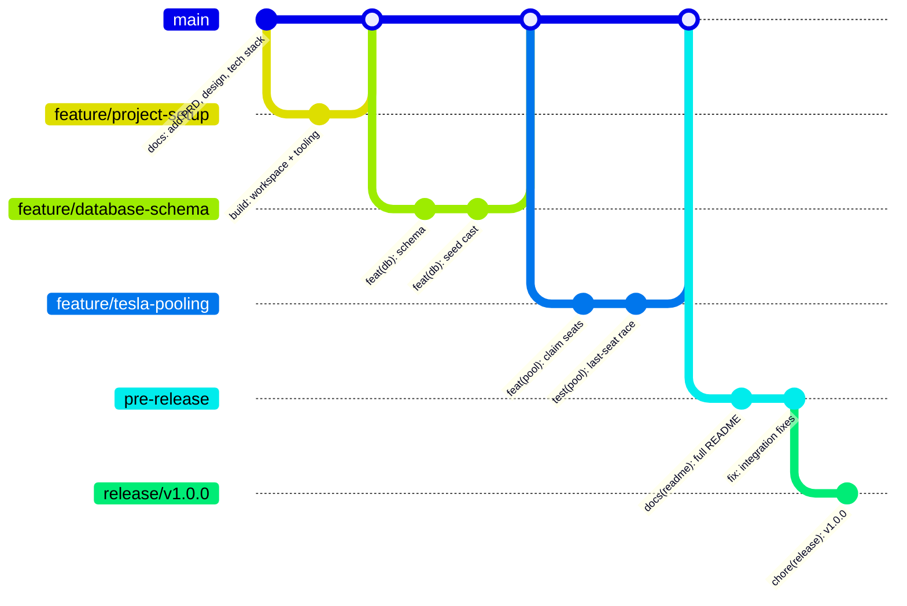
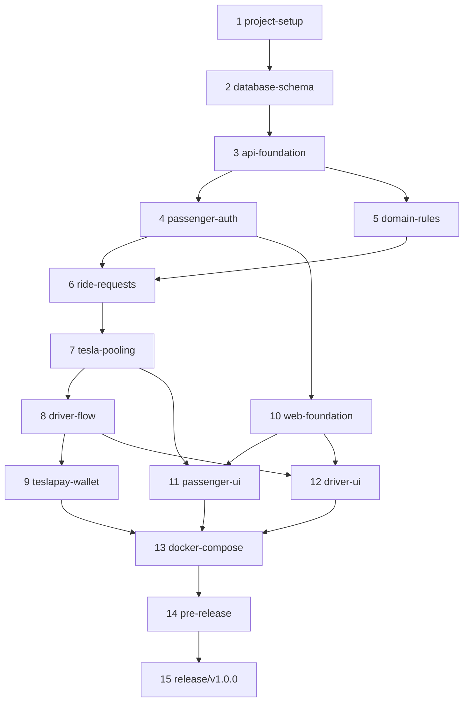

# Dhaka Tesla Pool — Implementation Task List

| | |
|---|---|
| Scope | Everything needed to ship v1.0.0 as the brief defines it |
| Companion docs | [`PRD.md`](./PRD.md) · [`DESIGN.md`](./DESIGN.md) · [`TECH_STACK.md`](./TECH_STACK.md) |

How to read this list:

- Work is grouped into **phases**. Each phase is one `feature/*` branch, merged into `master` when its "done when" checks pass. That produces the history the brief inspects.
- Each task has **How** (direction for doing it), **Done when** (a check you can actually run), and a suggested **commit** in the required `<type>(<scope>): <description>` format. Several small tasks can share one commit if they are one logical change. Do not make commits just to satisfy the rule.
- IDs (`T3.2`) are for cross-referencing only.
- Priority follows the PRD: everything is P0 unless marked **(P1)**.

---

## 0. Ground rules: git and process

### Branch model (required by the brief, Section 10)

(Mermaid's `gitGraph` always labels the first branch `main`; in the real repo it is **`master`**.)

| Branch | Lives | Purpose |
|---|---|---|
| `master` | forever | Integration branch. Only merges from `feature/*` land here |
| `feature/<name>` | until merged | One logical feature with incremental commits |
| `pre-release` | forever | Cut from `master` once MVP features are integrated. Integration fixes, docs, deployment checks |
| `release/v1.0.0` | forever | Cut from `pre-release`. The exact version shown in the video and deployment |

### T0.1 Set up the repository branches
- **How:** If the host created `main`, rename it: `git branch -m main master && git push -u origin master`, then set `master` as the default branch in the host's settings and delete remote `main`. Enable branch protection on `master` if the host allows (no direct pushes).
- **Done when:** `git branch -a` shows `master` as default and no `main`.

### T0.2 Agree the commit rules
- **How:** Types: `feat`, `fix`, `refactor`, `test`, `docs`, `chore`, `build`. Scopes used in this project: `repo`, `db`, `api`, `auth`, `zones`, `fare`, `ride`, `pool`, `driver`, `wallet`, `web`, `passenger-ui`, `driver-ui`, `docker`, `deploy`, `readme`, `release`. Never use "update", "changes", "final", "wip", "working now". Merge feature branches with a merge commit (`git merge --no-ff feature/x`) so the branch is visible in history.
- **Done when:** Optional: a `commit-msg` hook (commitlint) rejects `update stuff`.

### T0.3 Definition of done (applies to every phase)
- Lint, type-check, and tests pass: `npm run lint && npm run typecheck && npm test`.
- `DESIGN.md` updated if the implementation changed the design.
- New environment variables added to `.env.example`.
- The cast (Jashim, Bullet, Nusrat, Rafiq, Shirin) is used in any new seed data or tests.

### T0.4 Keep the brief out of the public repo
- **How:** The PDF is someone else's document. Add `pdfs/` and `uploads/` to `.gitignore`, and reference the brief by name in the README instead of committing it.
- **Done when:** `git status` does not show the PDF.

---

## Phase 1 — `feature/project-setup`

### T1.1 Commit the planning docs first
- **How:** Commit `docs/PRD.md`, `docs/DESIGN.md`, `docs/TECH_STACK.md`, `docs/TASKS.md` directly as the first commit on `master` (or via this branch). This is the "architecture first" evidence the brief asks for in Section 9.
- **Commit:** `docs(repo): add PRD, system design, tech stack and task plan`

### T1.2 Create the npm workspace
- **How:**
  - Root `package.json` with `"private": true` and `"workspaces": ["apps/*", "packages/*"]`.
  - Root scripts: `dev`, `build`, `lint`, `typecheck`, `test`, `db:migrate`, `db:seed`, each delegating with `npm run -w` / `npm run -ws --if-present`.
  - `.nvmrc` with `24`; `"engines": { "node": ">=24" }`.
- **Done when:** `npm install` succeeds on an empty workspace.

### T1.3 Shared tooling
- **How:** Root `tsconfig.base.json` (`strict`, `noUncheckedIndexedAccess`, `module: NodeNext` for the API). ESLint flat config + Prettier at the root. `.editorconfig`. `.gitignore` covering `node_modules`, `.next`, `dist`, `.env`, `coverage`, `pdfs/`, `uploads/`.
- **Done when:** `npm run lint` runs (even with nothing to lint).
- **Commit:** `build(repo): set up npm workspace, TypeScript and lint tooling`

### T1.4 `packages/shared` skeleton
- **How:** Package `@teslapool/shared` exporting enums (`RequestStatus`, `PoolStatus`, `MemberStatus`, `PaymentMethod`, `UserRole`) as `as const` objects plus Zod enums. Build with `tsc` to `dist`, or use TypeScript project references. Keep it contracts-only (see DESIGN §3).
- **Done when:** A test file in the package imports the enums and passes.
- **Commit:** `feat(repo): add shared package with domain enums`

### T1.5 Local Postgres via Compose
- **How:** `compose.yaml` with `db` (`postgres:17-alpine`, port `54329:5432`, named volume, `pg_isready` health check) and `db-test` (port `54330:5432`, `tmpfs` data dir for speed, no volume). Create `.env.example` with the DB variables from TECH_STACK §5.
- **Done when:** `docker compose up -d db db-test` and both report `healthy`.
- **Commit:** `build(docker): add compose services for postgres and test database`

Merge `feature/project-setup` → `master`.

---

## Phase 2 — `feature/database-schema`

### T2.1 Scaffold the API package
- **How:** `apps/api` with `package.json` (`type: module`), dependencies `fastify`, `drizzle-orm`, `pg`, `zod`; dev dependencies `drizzle-kit`, `tsx`, `vitest`, `@types/pg`. `src/config.ts` parses env with Zod (`DATABASE_URL`, `JWT_SECRET` min 32, tariff values with PRD defaults, `POOL_DETOUR_LIMIT_M`) and exits with a readable message on failure.
- **Done when:** `npm exec -w @teslapool/api -- tsx src/config.ts` fails clearly without env and passes with `.env`.

### T2.2 Define the schema in Drizzle
- **How:** In `src/db/schema.ts`, define every table, enum, CHECK, partial unique index, and generated column exactly as in DESIGN §7.3. Checklist, since these are the integrity guarantees:
  - [ ] `pools`: `CHECK (seats_taken BETWEEN 0 AND capacity)`
  - [ ] `pools`: partial unique `(vehicle_id)` where active
  - [ ] `ride_requests`: partial unique `(passenger_id)` where active
  - [ ] `ride_requests`: `CHECK (pickup_zone_id <> dropoff_zone_id)`, seats 1–6
  - [ ] `ride_requests`: unique `(passenger_id, idempotency_key)`
  - [ ] `pool_members`: partial unique `(ride_request_id)` where `ACTIVE`; `fare_paisa` generated; `CHECK (fare_paisa >= 0)`
  - [ ] `zone_distances`: `distance_m % 100 = 0`
  - [ ] `driver_profiles`: online implies zone
  - [ ] `wallets`: `CHECK (balance_paisa >= 0)`
  - [ ] `wallet_transactions`: partial unique `(ride_request_id, type)`
  - [ ] `ride_events`: request-or-pool check; indexes
  - [ ] every index listed in DESIGN §7.3
- **Done when:** `drizzle-kit generate` produces one readable SQL migration. Read it top to bottom and confirm each checklist item appears in SQL. If Drizzle cannot express something (for example a generated column), hand-edit the migration and note it in a comment.
- **Commit:** `feat(db): add schema for users, vehicles, zones, rides, pools and wallet`

### T2.3 Migration runner
- **How:** `src/db/migrate.ts` using `drizzle-orm/node-postgres/migrator`; script `db:migrate`. It must be safe to run repeatedly.
- **Done when:** Running it twice against the local DB succeeds both times; `\d pools` in `psql` shows the check constraint.
- **Commit:** `feat(db): add migration runner script`

### T2.4 Seed the story cast
- **How:** `src/db/seed.ts`, idempotent (upsert by slug/email):
  - 10 zones and 90 directed distance rows from DESIGN §5 (generate the symmetric rows in code from the upper-triangle list).
  - Users (password for all: `TeslaPool!2026`, hashed with Argon2id):

    | Name | Email | Role | Extra |
    |---|---|---|---|
    | Jashim | `jashim@teslapool.test` | DRIVER | Vehicle **Bullet**, plate `DHAKA-TESLA-11`, capacity 3; offline; home zone Banani |
    | Nusrat | `nusrat@teslapool.test` | PASSENGER | Wallet ৳500.00 |
    | Rafiq | `rafiq@teslapool.test` | PASSENGER | Wallet ৳300.00 |
    | Shirin | `shirin@teslapool.test` | PASSENGER | Wallet ৳50.00 (less than her ৳80 solo fare, which demonstrates `INSUFFICIENT_BALANCE`; cash still works) |

  - One **completed** pooled ride "yesterday" (Nusrat + Rafiq on Bullet, fares ৳90.00 and ৳96.00, with a full event trail and wallet debits) so history pages are not empty in the demo.
  - `npm run db:seed:reset` (P1) truncates rides, pools, members, events, and transactions, then re-seeds, for re-running the demo.
- **Done when:** Seeding twice leaves exactly 4 users and 1 historical pool; the historical fares match the PRD worked example.
- **Commit:** `feat(db): seed Dhaka zones, distances and the Banani rush-hour cast`

### T2.5 Constraint smoke tests
- **How:** Vitest integration tests against `db-test` that insert directly and expect Postgres errors: seats over capacity (`23514`), second active pool for Bullet (`23505`), second active request for Nusrat (`23505`), negative wallet (`23514`). Add a `test/setup.ts` global setup that runs migrations once and truncates tables between tests.
- **Done when:** `npm test -w @teslapool/api` passes and fails if you delete a constraint from the migration.
- **Commit:** `test(db): verify capacity and uniqueness constraints at the database level`

Merge → `master`.

---

## Phase 3 — `feature/api-foundation`

### T3.1 Fastify app factory
- **How:** `src/app.ts` exports `buildApp({ db, config })` so tests get a fresh app with the test DB. Register: Zod type provider, `@fastify/helmet`, `@fastify/cookie`, `@fastify/rate-limit` (global off, enabled per route), request ID (`genReqId` using `x-request-id` or a random ID, echoed in the response header). `src/server.ts` only calls `listen` on `0.0.0.0:${API_PORT}`.
- **Done when:** `npm run dev -w @teslapool/api` starts and logs JSON.

### T3.2 Error model
- **How:** `lib/errors.ts` with `class AppError(status, code, message, details?)` and the codes from DESIGN §10.3. One `setErrorHandler` that maps: `AppError` → its status; Zod validation → 400 `VALIDATION_ERROR` with field details; Postgres `23505`/`23514` by constraint name → the matching 409 code; anything else → 500 `INTERNAL` with the stack logged but not returned. Every response includes `requestId`.
- **Done when:** Unit tests cover each mapping, including an unknown constraint name falling back to 500.
- **Commit:** `feat(api): add app factory, error envelope and constraint-to-error mapping`

### T3.3 Logging
- **How:** pino via Fastify's logger option; `redact: ['req.headers.cookie', 'req.headers.authorization', '*.password']`; `pino-pretty` only in development. Add `lib/events.ts` with `recordEvent(tx, {...})` that inserts into `ride_events` and emits a domain log line.
- **Done when:** A login attempt log shows no password or cookie.

### T3.4 Health check
- **How:** `GET /health` runs `SELECT 1` with a 1 s timeout; `200 {status:"ok", db:"ok"}` or `503 {status:"degraded", db:"down"}`.
- **Done when:** Stopping the `db` container turns it into 503.
- **Commit:** `feat(api): add structured logging and database health check`

### T3.5 API Dockerfile and migrate service
- **How:** Multi-stage `apps/api/Dockerfile` (`node:24-alpine`): install with `npm ci`, build workspace packages, then a slim runtime stage running as a non-root user. Add Compose services `migrate` (runs `db:migrate && db:seed`, `restart: "no"`) and `api` (`depends_on: migrate: condition: service_completed_successfully`, health check on `/health`, port `48080:4000`).
- **Done when:** `docker compose up api` from a clean state migrates, seeds, and serves `/health`.
- **Commit:** `build(docker): containerise api with migration and seed step`

Merge → `master`.

---

## Phase 4 — `feature/passenger-auth`

### T4.1 Password hashing
- **How:** `modules/auth/password.ts` wrapping `@node-rs/argon2` `hash`/`verify`. Never log inputs.

### T4.2 Session plugin
- **How:** `@fastify/jwt` configured with `cookie: { cookieName: 'dtp_session', signed: false }`. `setSession(reply, user)` signs `{ sub, role }` with 7-day expiry and sets the cookie `HttpOnly; SameSite=Lax; Path=/; Secure` (in production). Decorators `app.authenticate` and `requireRole(role)` as preHandlers; `request.user` typed.

### T4.3 Auth routes
- **How:**
  - `POST /auth/signup`: body `{ name, email, phone, password (min 8) }`; creates a `PASSENGER` and a wallet with ৳200.00 starting balance (assumption; document it); sets session; `201`.
  - `POST /auth/login`: generic `401 UNAUTHENTICATED "Email or password is incorrect"` for both unknown email and wrong password; rate limit 10/min/IP.
  - `POST /auth/logout`: clears cookie; `204`.
  - `GET /auth/me`: user, role, and for drivers `{ vehicle, isOnline, currentZone }`.
- **Done when:** Integration tests: signup → me; login wrong password → 401; 11th login in a minute → 429; duplicate email → 409 `EMAIL_TAKEN` (add this code); a passenger calling a driver-only route → 403.
- **Commit:** `feat(auth): add passenger sign-up, login and session cookie`
- **Commit:** `test(auth): cover login failures, rate limit and role guard`

Merge → `master`.

---

## Phase 5 — `feature/domain-rules`

Pure logic with no database, so it can be unit-tested exhaustively before any endpoint uses it.

### T5.1 Fare engine
- **How:** `modules/fares/fare.ts` exactly as DESIGN §8, reading tariff from config. Validate at startup: `perKmPaisa % 10 === 0` and `0 ≤ discount ≤ 50`.
- **Done when:** Unit tests reproduce the PRD worked example table cell by cell (Nusrat 10,250 → 9,000; Rafiq 11,000 → 9,600; Shirin 8,000 → 7,200), plus a single-rider pool has zero discount, and every total is an integer.
- **Commit:** `feat(fare): add integer-paisa fare engine with pool discount`

### T5.2 State machine
- **How:** `lib/state-machine.ts` with the two transition tables and `assertTransition` from DESIGN §6.3. Export `isActiveRequestStatus` and `isJoinablePoolStatus` helpers so the "active" definition lives in one place (and matches the partial index predicates).
- **Done when:** A table-driven test enumerates **every** from/to pair for both machines: allowed ones pass, all others throw `INVALID_TRANSITION`.
- **Commit:** `feat(pool): add ride request and pool state machines`

### T5.3 Matching rule
- **How:** `modules/pools/matching.ts`: `isCompatible({ pool, members, request, distance })` implementing PRD §7 and returning either `{ ok: true }` or `{ ok: false, reason }` (`NOT_SHARED`, `DIFFERENT_PICKUP`, `TOO_FAR:<zone>`, `NO_SEATS`, `NOT_JOINABLE`). The reason is used in logs and in the driver's candidate list.
- **Done when:** Tests: Nusrat + Rafiq compatible; + Shirin (Gulshan 2) compatible; Shirin to Uttara rejected with `TOO_FAR`; `allowPool=false` rejected; 3 seats taken rejected.
- **Commit:** `feat(pool): add same-pickup, 3 km destination-spread matching rule`

### T5.4 Zones and quote endpoints
- **How:** `GET /zones` (cached in memory at startup; it is static). `GET /fares/quote?pickup&dropoff` returns `{ distanceM, solo: breakdown, pooled: breakdown }`. Reject same zone with 400.
- **Done when:** `curl localhost:48080/api/v1/fares/quote?pickup=1&dropoff=4` shows 10,250 / 9,000 for Banani → Mohakhali.
- **Commit:** `feat(zones): expose zones and fare quote endpoints`

Merge → `master`.

---

## Phase 6 — `feature/ride-requests`

### T6.1 Create a ride request
- **How:** `POST /rides` (passenger). In one transaction:
  1. Validate body with the shared Zod schema.
  2. If `Idempotency-Key` matches an existing request for this passenger, return it with `200`.
  3. Look up distance; compute solo fare.
  4. If `WALLET`, check balance ≥ solo fare, else `422 INSUFFICIENT_BALANCE`.
  5. Insert with `REQUESTED` (the partial unique index turns a second active request into `409 ACTIVE_RIDE_EXISTS`).
  6. Record `REQUEST_CREATED`.
  7. **Auto-match**: implemented in Phase 7 (T7.3). For now, leave the request `REQUESTED`.
- **Done when:** Tests: happy path 201; same idempotency key twice → same ID; second active request → 409; Shirin with wallet → 422, with cash → 201.
- **Commit:** `feat(ride): let passengers request a ride with a fare estimate`

### T6.2 Read own rides
- **How:** `GET /rides?status=active|history` and `GET /rides/:id`. Always filter by `passenger_id = request.user.sub`; not found **or** not yours → 404. The detail includes own fare breakdown (from the active membership if any, otherwise the solo estimate), driver name and vehicle, `coRiderCount` (active members minus one), and the event timeline for this request only. Never return other members' names, destinations, or fares.
- **Done when:** Test: Nusrat fetching Rafiq's ride → 404; response snapshot contains no other passenger's name.
- **Commit:** `feat(ride): add passenger ride detail and history with privacy filtering`

### T6.3 Cancel own ride
- **How:** `POST /rides/:id/cancel` with optional `{ reason }`. Lock the request (`FOR UPDATE`); `assertTransition(request, status, 'CANCELLED')`. If in a pool: lock the pool **first** (lock ordering from DESIGN §9.1), mark membership `LEFT`, decrement `seats_taken`, recompute remaining members' fares, and auto-cancel the pool if no active members remain. Write all events.
- **Done when:** Tests: cancel `REQUESTED` ✓; cancel `MATCHED` releases the seat and Rafiq's fare goes back to solo when Nusrat leaves; last member leaves → pool `CANCELLED`; cancel `STARTED` → 409; cancel someone else's → 404.
- **Commit:** `feat(ride): allow cancellation before the trip starts and release seats`

Merge → `master`. (Cancellation-in-pool tests can be completed in Phase 7 if the pool pieces are not there yet; note it in the PR/merge message.)

---

## Phase 7 — `feature/tesla-pooling`

The phase the interview will focus on. Keep every write path through `claimSeats`.

### T7.1 `claimSeats` service
- **How:** `modules/pools/pool.service.ts`, `claimSeats(tx, poolId, requestId, actor)`, following the SQL in DESIGN §9.1: lock pool `FOR UPDATE`; load active members; lock the request `FOR UPDATE` and require `REQUESTED`; run `isCompatible`; update `seats_taken`; insert membership; update request status (to `MATCHED`, and also `DRIVER_ARRIVED` if the pool already arrived); recompute all members' fares; record `MEMBER_JOINED`, status, and `FARE_RECALCULATED` events. Throw `POOL_FULL`, `NOT_COMPATIBLE`, or `REQUEST_ALREADY_MATCHED`.
- **Commit:** `feat(pool): claim seats inside a row-locked transaction`

### T7.2 Driver accepts a request (creates a pool)
- **How:** `POST /driver/requests/:id/accept`. Require driver online and in the request's pickup zone. In one transaction: lock the request, insert a pool (`ACCEPTED`, `capacity` copied from Bullet, `is_shared = request.allow_pool`), then `claimSeats`. The vehicle's partial unique index turns a second active pool into `409 ACTIVE_POOL_EXISTS`.
- **Commit:** `feat(pool): create a pool when a driver accepts a request`

### T7.3 Auto-match on request creation
- **How:** In `POST /rides` after insert (same transaction, or a second short transaction right after), select candidate pools with the matching index (same pickup, joinable, shared, `seats_taken + seats <= capacity`, oldest first, limit 5). Try `claimSeats` on each in a savepoint; on `POOL_FULL` or `NOT_COMPATIBLE`, roll back the savepoint and try the next. If none succeeds, stay `REQUESTED`.
- **Done when:** Test: Jashim accepts Nusrat; Rafiq's `POST /rides` returns `MATCHED` with fare 9,600 and Nusrat's detail now shows 9,000 and `coRiderCount: 1`.
- **Commit:** `feat(pool): auto-match new requests into compatible open pools`

### T7.4 Candidates and manual add
- **How:** `GET /pools/:id/candidates` returns waiting requests in the pool's zone with `isCompatible` evaluated (compatible ones first, others with the reason, for transparency). `POST /pools/:id/members { rideRequestId }` calls `claimSeats`. Both are owner-only (404 if not your pool).
- **Commit:** `feat(pool): let drivers view and add compatible waiting requests`

### T7.5 Concurrency tests (required by the brief)
- **How:** In `test/concurrency.test.ts`, create **two independent `pg` pools** (separate connections are essential; one connection would serialise the queries and prove nothing).
  1. **Last seat.** Setup: Bullet pool with Rafiq holding 2 seats (1 left). Fire `claimSeats` for Nusrat and Shirin with `Promise.allSettled`. Assert exactly one fulfilled, one rejected with `POOL_FULL`, `seats_taken = 3`, and 3 active seat-units in `pool_members`. Run 50 iterations.
  2. **Double accept.** Jashim and a second test-only driver (name him **Karim**, in test fixtures only, driving **Rocket**) accept Nusrat's request at once. Exactly one pool contains her.
  3. **HTTP version** of test 1 with `app.inject()` in parallel.
  4. **Double submit.** Nusrat posts two rides at once without an idempotency key; exactly one is created.
- **Done when:** All pass 50/50 locally. Temporarily remove `FOR UPDATE` and confirm test 1 fails (then the CHECK constraint catches it and maps to `POOL_FULL`; remove both to see overbooking). Record this experiment in the README's concurrency section; it is excellent interview material.
- **Commit:** `test(pool): prove concurrent last-seat claims cannot overbook Bullet`

### T7.6 Capacity and lifecycle invariants test
- **How:** A test helper `assertPoolInvariants(poolId)` checks: `seats_taken` equals the sum of active member seats, `seats_taken ≤ capacity`, every active member's request status mirrors the pool status. Call it after each step in the lifecycle tests.
- **Commit:** `test(pool): assert seat and status invariants across the lifecycle`

Merge → `master`.

---

## Phase 8 — `feature/driver-flow`

### T8.1 Online / offline
- **How:** `PATCH /driver/status { isOnline, currentZoneId? }`. Going online requires a zone. Going offline with an active pool → `409 ACTIVE_POOL_EXISTS`.
- **Commit:** `feat(driver): let drivers go online in a zone and offline when idle`

### T8.2 Waiting-request feed
- **How:** `GET /driver/requests`: `REQUESTED` rides in the driver's current zone, oldest first, with passenger first name, dropoff, seats, pool preference, and estimated fare. Empty array if offline (the UI shows "Go online to see riders").
- **Commit:** `feat(driver): show waiting requests in the driver's current zone`

### T8.3 Lifecycle actions
- **How:** `POST /pools/:id/arrive|start|complete|cancel`. Each: lock the pool; check ownership; `assertTransition`; update pool + every active member's request in the same transaction; write events.
  - `start`: requires ≥ 1 active member; freezes fares (`FARE_FINALIZED` per member).
  - `complete`: copies `fare_paisa` to `ride_requests.final_fare_paisa`, sets `completed_at`, then calls the payment step (Phase 9; until then, record `CASH_DUE_RECORDED` for everyone).
  - `cancel`: memberships → `REMOVED`, requests → `REQUESTED` (re-queued), `seats_taken = 0`.
- **Done when:** Tests: full happy path Nusrat + Rafiq + Shirin; `complete` before `start` → 409; `arrive` twice → 409; driver cancel re-queues all three; another driver cannot act on Jashim's pool (404).
- **Commit:** `feat(driver): add arrive, start, complete and cancel actions for pools`
- **Commit:** `test(driver): reject out-of-order and foreign pool transitions`

### T8.4 Current pool and history
- **How:** `GET /driver/pools/current` returns the pool with members (full detail for the driver), seat meter data, allowed next actions (`["arrive","cancel"]` computed from the state machine, so the UI never hard-codes rules). `GET /driver/pools` for history with totals per pool.
- **Commit:** `feat(driver): expose current pool with next actions and pool history`

Merge → `master`.

---

## Phase 9 — `feature/teslapay-wallet`

### T9.1 Charge on completion
- **How:** Inside the `complete` transaction, for each `WALLET` member: `UPDATE wallets SET balance_paisa = balance_paisa - $fare WHERE user_id = $1 RETURNING balance_paisa`, insert `wallet_transactions (RIDE_CHARGE, -fare, balance_after)`, event `PAYMENT_CAPTURED`. For `CASH`, event `CASH_DUE_RECORDED` with the amount. The partial unique index prevents double charging if *Complete* is retried.
- **Done when:** Tests: Nusrat's balance drops by exactly 9,000 after the pooled ride; retrying complete → 409 and no second transaction; a wallet going negative is impossible (CHECK).
- **Commit:** `feat(wallet): charge TeslaPay wallets atomically when a pool completes`

### T9.2 Wallet endpoint (P1)
- **How:** `GET /wallet` with balance and the last 20 transactions.
- **Commit:** `feat(wallet): add wallet balance and transaction history endpoint`

Merge → `master`.

---

## Phase 10 — `feature/web-foundation`

### T10.1 Scaffold Next.js
- **How:** `npx create-next-app@latest apps/web --ts --tailwind --eslint --app --src-dir --import-alias "@/*"` (npm workspaces; do not introduce pnpm). Dev port **43123** (`next dev -p 43123`). Add `next.config.ts` rewrites: `/api/:path*` → `${API_INTERNAL_URL}/api/:path*`. Add security headers.
- **Done when:** `npm run dev -w @teslapool/web` serves the page and `/api/v1/zones` returns zones through the rewrite.
- **Commit:** `feat(web): scaffold Next.js app with same-origin API rewrite`

### T10.2 shadcn/ui and app shell
- **How:** `npx shadcn@latest init`, then add `button card input label select switch dialog badge skeleton sonner separator`. App shell: top bar with product name, role badge, and sign-out; mobile-first container. Pick one accent colour and use it consistently.
- **Commit:** `feat(web): add shadcn/ui primitives and responsive app shell`

### T10.3 API client and query setup
- **How:** `src/lib/api.ts`: `apiFetch<T>(path, init)` with `credentials: 'include'`, JSON handling, and an `ApiError` class carrying `code`, `message`, `requestId`. `QueryClientProvider` in the root layout. `src/lib/money.ts`: `formatTaka(paisa)` → `৳90.00` using integer math only. Query hooks per resource in `src/lib/queries/`.
- **Done when:** A unit test covers `formatTaka(9000) === "৳90.00"` and `formatTaka(10250) === "৳102.50"`.
- **Commit:** `feat(web): add typed API client, query provider and taka formatting`

### T10.4 Auth pages and guard
- **How:** `/login` and `/signup` forms using the shared Zod schemas; server errors shown inline. `/` landing page explains the product in two lines and shows **demo sign-in cards** for Jashim, Nusrat, Rafiq, and Shirin (one click fills and submits). `src/proxy.ts` redirects signed-out users away from `/ride`, `/history`, `/drive`; after login, redirect by role (passenger → `/ride`, driver → `/drive`).
- **Done when:** Signing in as Jashim lands on `/drive`, as Nusrat on `/ride`; visiting `/drive` as Nusrat redirects or shows "Drivers only".
- **Commit:** `feat(web): add sign-in, sign-up and role-based routing with demo accounts`

Merge → `master`.

---

## Phase 11 — `feature/passenger-ui`

### T11.1 Ride request form (`/ride`)
- **How:** Pickup and destination selects (destination excludes the pickup), seat stepper 1–3, "Share my ride" switch (on by default, with helper text "Save up to 20% on distance"), payment radio (Cash / TeslaPay with balance). A live quote card shows solo and pooled fares as soon as both zones are chosen. Submit sends an `Idempotency-Key` (`crypto.randomUUID()` created when the form mounts), and the button is disabled while pending.
- **States:** skeleton while zones load; inline validation; `INSUFFICIENT_BALANCE` shows "Your TeslaPay balance is ৳50.00. Switch to cash?" with a one-click switch; `ACTIVE_RIDE_EXISTS` redirects to the active ride.
- **Commit:** `feat(passenger-ui): add ride request form with live fare quote`

### T11.2 Active ride view (`/ride/[id]` and on `/ride` when active)
- **How:** `StatusStepper`; big status sentence ("Jashim is on the way in Bullet" / "Waiting for a Tesla in Banani"); `FareBreakdown` with estimate/final badge; "Sharing with 1 other rider" (count only); cancel button with `ConfirmDialog`, shown only when the API says cancel is allowed. Poll every 3 s; stop on terminal state. Show a toast when the fare changes because someone joined: "Someone joined your Tesla. Your fare dropped to ৳90.00." Never name the co-rider.
- **States:** loading skeleton; error card with retry; completed screen with final fare and "Book another ride".
- **Commit:** `feat(passenger-ui): add live ride status, fare breakdown and cancel`

### T11.3 History (`/history`) and wallet (`/wallet`, P1)
- **How:** List of rides with date, route, status badge, final fare, payment method; tap to expand the event timeline. Empty state: "No rides yet. Your first Banani escape is one tap away."
- **Commit:** `feat(passenger-ui): add ride history with timeline and wallet page`

Merge → `master`.

---

## Phase 12 — `feature/driver-ui`

### T12.1 Driver dashboard (`/drive`)
- **How:** Header card: Jashim, Bullet, online switch with zone select (switch disabled with a tooltip while a pool is active). Three states of the main area:
  1. **Offline:** "You're offline. Go online to see riders near you."
  2. **Online, idle:** waiting-request list (first name, destination, seats, pool preference, fare) with *Accept*. Empty state: "No riders waiting in Banani right now." Polls every 3 s.
  3. **Active pool:** `SeatMeter` (2 / 3 seats), `PoolMemberList` (name, destination, seats, fare, cash/wallet), total to collect, a candidates section (compatible first; incompatible greyed out with the reason, e.g. "Uttara is 15.7 km from Mohakhali"), and **one primary button for the next action** from `nextActions` (Arrived → Start trip → Complete trip) plus a secondary *Cancel pool*.
- **States:** a `409` from any action shows the server message in a toast and refetches. Complete asks for confirmation and shows cash to collect per rider.
- **Commit:** `feat(driver-ui): add driver dashboard with online toggle and request feed`
- **Commit:** `feat(driver-ui): add active pool view with seat meter and next action`

### T12.2 Driver history (`/drive/history`)
- **How:** Past pools: date, pickup, number of riders, total collected, status; expand for members and timeline.
- **Commit:** `feat(driver-ui): add pool history for drivers`

Merge → `master`.

---

## Phase 13 — `feature/docker-compose`

### T13.1 Web Dockerfile
- **How:** Next.js `output: 'standalone'`; multi-stage build on `node:24-alpine`; runtime runs `node server.js` as a non-root user; `API_INTERNAL_URL` read at runtime for rewrites (rewrites are evaluated at build time by default, so pass it as a build arg as well, or use a runtime-resolved route; verify which applies to your Next version and document it).
- **Commit:** `build(docker): containerise the Next.js web app`

### T13.2 Full Compose stack
- **How:** `web` service (port `43123:3000`, depends on `api` healthy, health check `wget -qO- localhost:3000`). All services read from `.env`. `docker compose up` alone must bring up db → migrate → api → web.
- **Done when:** On a clean clone (`git clone … && cd … && cp .env.example .env && docker compose up --build`), the full demo works at `http://localhost:43123`. Test this on a second machine or a fresh VM if possible; the brief grades "runs reliably elsewhere."
- **Commit:** `build(docker): run web, api, migrations and postgres with one compose command`

### T13.3 CI (P1)
- **How:** A workflow that runs `npm ci`, lint, type-check, starts `db-test` as a service container, runs tests, and builds both Docker images.
- **Commit:** `build(repo): add CI for lint, typecheck, tests and image builds`

Merge → `master`. **MVP features are now integrated.**

---

## Phase 14 — `pre-release` branch

Cut it: `git checkout master && git checkout -b pre-release && git push -u origin pre-release`. From here, only integration fixes, docs, and deployment work.

### T14.1 End-to-end story test (P1)
- **How:** Playwright test with two browser contexts: Jashim goes online in Banani; Nusrat requests Mohakhali; Jashim accepts; Rafiq requests Gulshan 1 and is auto-matched; both fares are checked in the UI (৳90.00, ৳96.00); arrive, start, complete; history shows the ride.
- **Commit:** `test(web): add end-to-end rush-hour pooling story`

### T14.2 Integration fixes
- **How:** Run the full demo script from PRD §2 three times with `db:seed:reset` between. Fix every rough edge on this branch with `fix(<scope>): …` commits.

### T14.3 README (every section the brief lists)
- **How:** Write `README.md` with, in this order:
  1. Title, one-line pitch, **demo video link at the top**, deployment URL.
  2. Summary and problem statement (your own words).
  3. Features implemented (checklist mapped to PRD IDs).
  4. Screenshots or GIFs: request form, active ride, driver pool with seat meter, history.
  5. Architecture diagram and ERD (copy the Mermaid from DESIGN).
  6. Tech stack table with justification (from TECH_STACK).
  7. Project structure.
  8. Prerequisites (Docker, or Node 24 + npm for local dev).
  9. Environment variables (point to `.env.example`, never real values).
  10. Local setup, Docker instructions, migration and seed commands, reset command.
  11. Running frontend, backend, and tests.
  12. **Demo credentials** (the cast table from T2.4).
  13. API overview (endpoint table).
  14. Fare model with the worked example.
  15. Matching rule and ride lifecycle.
  16. **Concurrency**: the last-seat race, how it is handled now, the lock-removal experiment from T7.5, and what changes at scale.
  17. Key decisions and trade-offs; assumptions (PRD §12).
  18. Known limitations and next improvements.
  19. **AI Usage**: tools used, what for, one accepted suggestion, one rejected or changed suggestion and why. Be specific and honest.
  20. Bonus: scaling to 1M passengers (link or copy DESIGN §14).
- **Commit:** `docs(readme): document setup, architecture, decisions and AI usage`

### T14.4 Deploy on free tiers
- **How:**
  1. Create a Neon free project; run migrations and seed against it from your machine (`DATABASE_URL=… npm run db:migrate && npm run db:seed`).
  2. Render: new web service from `apps/api/Dockerfile`, env vars from `.env.example` with production values (fresh `JWT_SECRET`), health check path `/health`.
  3. Vercel: import the repo with root `apps/web`; set `API_INTERNAL_URL` to the Render URL.
  4. Check sign-in works (cookie is first-party on the Vercel domain via the rewrite), then run the demo end to end on the public URL.
  5. Record the free-tier limits you hit (cold starts) in the README.
- **If any free tier is unavailable:** document the constraint and the exact Docker steps instead (the brief allows this).
- **Commit:** `docs(deploy): add deployment guide and public URLs`

### T14.5 Final review against the brief
- **How:** Walk the brief's Section 14 checklist and Section 16 "What NOT to do" line by line. Also check: `git log --oneline master` reads like a story; no secrets in history (`git log -p | grep -i secret`); the cast appears in seed, tests, README, and screenshots.

---

## Phase 15 — `release/v1.0.0`

### T15.1 Cut the release
- **How:** `git checkout pre-release && git checkout -b release/v1.0.0`. Set `"version": "1.0.0"` in the root `package.json`, add `CHANGELOG.md` summarising features by phase. Tag `v1.0.0`. Point the deployment at this branch.
- **Commit:** `chore(release): prepare v1.0.0`

### T15.2 Record the six-minute video
- **How:** Loom or similar free tool, following the brief's timing:
  - **0:00–1:00:** the problem, users, and core idea in your own words. Do not read the PRD.
  - **1:00–3:00:** architecture and ERD on screen; backend, frontend, database design; the two state machines; **one key decision** (row-locked seat claims) and **one trade-off** (polling instead of WebSockets, or stateless JWT).
  - **3:00–6:00:** product tour. Passenger flow (Nusrat), driver flow (Jashim), pooling (Rafiq auto-joins, both fares drop), fare and status, **one edge case** (Shirin's wallet rejected and cash works, or a cancel re-queueing riders), and the deployment URL.
- **Done when:** The link is at the top of the README on `release/v1.0.0` (commit: `docs(readme): add demo video link`, made on `pre-release` and merged or cherry-picked into the release branch).

### T15.3 Interview preparation (not a commit)
Be able to answer, without notes:
- Walk through every table and why each constraint exists.
- What happens, line by line, when Nusrat and Shirin claim the last seat at once. What happens if `FOR UPDATE` is removed.
- Why a pool member table instead of `pool_id` on the request.
- Why integer paisa; how the fare is guaranteed to be whole.
- Why passenger status mirrors pool status, and where that is enforced.
- How a passenger is prevented from reading or cancelling someone else's ride.
- What changes first if the app gets 100× more users.
- One AI suggestion you rejected, and why.

---

## Appendix A — Required tests mapped to the brief (Section 12)

| Brief requirement | Test(s) |
|---|---|
| Bullet's capacity can never be exceeded | T2.5 (CHECK), T7.1, T7.6 invariants |
| Invalid state transitions are rejected | T5.2 (every pair), T8.3 (HTTP level) |
| Nusrat's and Rafiq's pooled fares calculate correctly | T5.1 (unit), T7.3 (through the API), T14.1 (UI) |
| Users can't modify another user's ride | T6.2, T6.3, T8.3 (404 on foreign ride/pool) |
| Cancellation rules hold | T6.3, T8.3 (driver cancel re-queues) |
| Two concurrent requests can't corrupt pool capacity | T7.5 (four race tests, 50 iterations each) |

## Appendix B — Phase dependency overview

Phases 4 and 5 can run in parallel; so can 10 (once auth exists) and 7–9. The critical path runs through the pooling work in Phase 7. Start there as soon as the schema and domain rules exist, and keep the UI thin until the concurrency tests pass. The brief is explicit that broken integrity with polished screens scores poorly.
